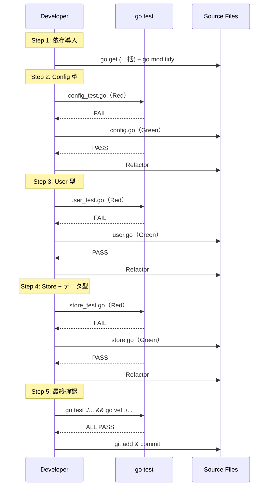

# M02: 基本型定義 - 実装詳細計画

## Meta
- マイルストーン: M02
- 前提: M01 完了（ディレクトリ構造・go.mod 済み）
- スペック参照: docs/specs/idproxy-spec.md Section 6, 7, 9, 10, 11
- レビュー: v2（弁証法レビュー反映済み）

## 目標

Config, OIDCProvider, OAuthConfig, User, Store インターフェース, Session, AuthCodeData, AccessTokenData の型定義を TDD で実装する。依存ライブラリを go get する。

## 弁証法レビューで反映した修正

1. **NewContextWithUser を unexported (newContextWithUser) に変更** — M02 スコープは UserFromContext のみ。テスト用にはテストファイル内で直接 context.WithValue を使用
2. **Store テストに `var _ Store = (*mockStore)(nil)` パターンを追加** — コンパイル時インターフェース実装検証
3. **Session/AuthCodeData/AccessTokenData は store.go に配置** — スペック Section 11 に準拠（session.go は M09 SessionManager 用）
4. **contextKey は `type contextKey struct{}` の unexported 型に決定**
5. **go get は一括実行 + go mod tidy**
6. **OAuthConfig テストは型存在確認のみ** — 実際の鍵生成は不要

## 依存ライブラリの導入

```bash
go get github.com/coreos/go-oidc/v3@latest golang.org/x/oauth2@latest github.com/golang-jwt/jwt/v5@latest github.com/gorilla/securecookie@latest github.com/google/uuid@latest
go mod tidy
```

## ファイル構成（スペック Section 11 準拠）

| ファイル | 内容 |
|---------|------|
| `config.go` | Config, OIDCProvider, OAuthConfig 構造体, DefaultConfig, DefaultScopes |
| `config_test.go` | Config 関連の型テスト |
| `user.go` | User 構造体, contextKey, UserFromContext(), newContextWithUser() |
| `user_test.go` | User, UserFromContext テスト |
| `store.go` | Store インターフェース, Session, AuthCodeData, AccessTokenData 型 |
| `store_test.go` | Store インターフェースのコンパイル確認テスト、データ型テスト |

## TDD 設計（Red → Green → Refactor）

### Step 1: 依存ライブラリの導入

```bash
go get github.com/coreos/go-oidc/v3@latest golang.org/x/oauth2@latest github.com/golang-jwt/jwt/v5@latest github.com/gorilla/securecookie@latest github.com/google/uuid@latest
go mod tidy
```

### Step 2: Config, OIDCProvider, OAuthConfig 型（config.go / config_test.go）

#### Red Phase
config_test.go に以下のテストを記述:
1. `TestConfigStructFields` - Config 構造体のフィールドが正しく設定・取得できること
2. `TestOIDCProviderStructFields` - OIDCProvider のフィールド確認
3. `TestOAuthConfigStructFields` - OAuthConfig のフィールド確認（SigningKey は crypto.Signer 型、SigningMethod は jwt.SigningMethod 型であることの型確認のみ）
4. `TestDefaultConfigValues` - DefaultConfig のデフォルト値が正しいこと（SessionMaxAge=24h, AccessTokenTTL=1h, AuthCodeTTL=10m, PathPrefix=""）
5. `TestDefaultScopes` - DefaultScopes が ["openid", "email", "profile"] であること

#### Green Phase
config.go に構造体を定義:
- `Config` - Providers, AllowedDomains, AllowedEmails, ExternalURL, CookieSecret, OAuth, Store, SessionMaxAge, AccessTokenTTL, AuthCodeTTL, Logger, PathPrefix
- `OIDCProvider` - Issuer, ClientID, ClientSecret, Scopes, Name
- `OAuthConfig` - SigningKey (crypto.Signer), SigningMethod (jwt.SigningMethod)
- `var DefaultConfig Config` - デフォルト値設定済み
- `var DefaultScopes = []string{"openid", "email", "profile"}`

#### Refactor Phase
- godoc コメントがスペックと一致するか確認

### Step 3: User 型と UserFromContext（user.go / user_test.go）

#### Red Phase
user_test.go に以下のテストを記述:
1. `TestUserStructFields` - User 構造体のフィールド（Email, Name, Subject, Issuer, Claims）が正しく設定・取得できること
2. `TestUserFromContext_WithUser` - context に User が設定されている場合、正しく取得できること（テスト内で context.WithValue + userContextKey を直接使用）
3. `TestUserFromContext_WithoutUser` - context に User がない場合、nil を返すこと

注意: テスト内から unexported な userContextKey にアクセスするため、テストは `package idproxy`（同一パッケージ）で記述する。

#### Green Phase
user.go に実装:
- `type contextKey struct{}` — unexported 型
- `var userContextKey = contextKey{}` — unexported 変数
- `User` 構造体 — Email, Name, Subject, Issuer, Claims map[string]interface{}
- `func UserFromContext(ctx context.Context) *User` — context から User を取得、なければ nil
- `func newContextWithUser(ctx context.Context, u *User) context.Context` — unexported、M12 で使用

#### Refactor Phase
- godoc コメント整理

### Step 4: Store インターフェースとデータ型（store.go / store_test.go）

#### Red Phase
store_test.go に以下のテストを記述:
1. `var _ Store = (*mockStore)(nil)` — コンパイル時インターフェース実装検証
2. `TestMockStoreImplementsStore` — mockStore が Store を実装することのランタイム確認
3. `TestSessionStructFields` — Session のフィールド確認
4. `TestAuthCodeDataStructFields` — AuthCodeData のフィールド確認
5. `TestAccessTokenDataStructFields` — AccessTokenData のフィールド確認

mockStore はテストファイル内に定義し、全メソッドを空実装（nil/error 返却）。

#### Green Phase
store.go に定義:
- `Store` インターフェース:
  - `SetSession(ctx context.Context, id string, session *Session, ttl time.Duration) error`
  - `GetSession(ctx context.Context, id string) (*Session, error)`
  - `DeleteSession(ctx context.Context, id string) error`
  - `SetAuthCode(ctx context.Context, code string, data *AuthCodeData, ttl time.Duration) error`
  - `GetAuthCode(ctx context.Context, code string) (*AuthCodeData, error)`
  - `DeleteAuthCode(ctx context.Context, code string) error`
  - `SetAccessToken(ctx context.Context, jti string, data *AccessTokenData, ttl time.Duration) error`
  - `GetAccessToken(ctx context.Context, jti string) (*AccessTokenData, error)`
  - `DeleteAccessToken(ctx context.Context, jti string) error`
  - `Cleanup(ctx context.Context) error`
  - `Close() error`
- `Session` 構造体 — ID, User (*User), ProviderIssuer, IDToken, CreatedAt, ExpiresAt
- `AuthCodeData` 構造体 — Code, ClientID, RedirectURI, CodeChallenge, CodeChallengeMethod, Scopes, User (*User), CreatedAt, ExpiresAt, Used
- `AccessTokenData` 構造体 — JTI, Subject, Email, ClientID, Scopes, IssuedAt, ExpiresAt, Revoked

#### Refactor Phase
- メソッドシグネチャがスペック Section 6 と完全一致するか確認
- godoc コメントがスペック Section 7 と一致するか確認

### Step 5: 全テスト実行・確認

```bash
go test ./...
go vet ./...
```

全テストが green、vet がクリーンであることを確認。

## シーケンス図



## リスク評価

| リスク | 影響度 | 対策 |
|--------|--------|------|
| 依存ライブラリのバージョン不整合 | 中 | go get 一括実行 + go mod tidy で整合性確認 |
| crypto.Signer / jwt.SigningMethod の import パス | 低 | crypto は標準ライブラリ、jwt/v5 を使用 |
| UserFromContext の context key 衝突 | 低 | unexported な struct{} 型で衝突を完全防止 |
| Store インターフェースの将来拡張性 | 中 | スペック通りに定義、M04 以降で MemoryStore 実装時に検証 |
| go 1.26 と依存ライブラリの互換性 | 低 | 主要ライブラリは Go 1.20+ 対応が標準 |

## 完了条件

1. 全ての型がスペック Section 6, 7 と一致している
2. ファイル配置がスペック Section 11 と一致している
3. `go test ./...` が全て PASS
4. `go vet ./...` がエラーなし
5. 各ファイルに適切な godoc コメントがある
6. DefaultConfig, DefaultScopes が定義されている
7. UserFromContext が正しく動作する（newContextWithUser は unexported）
8. Store インターフェースが定義され、`var _ Store = (*mockStore)(nil)` でコンパイル確認済み
9. Session, AuthCodeData, AccessTokenData が store.go に定義されている
