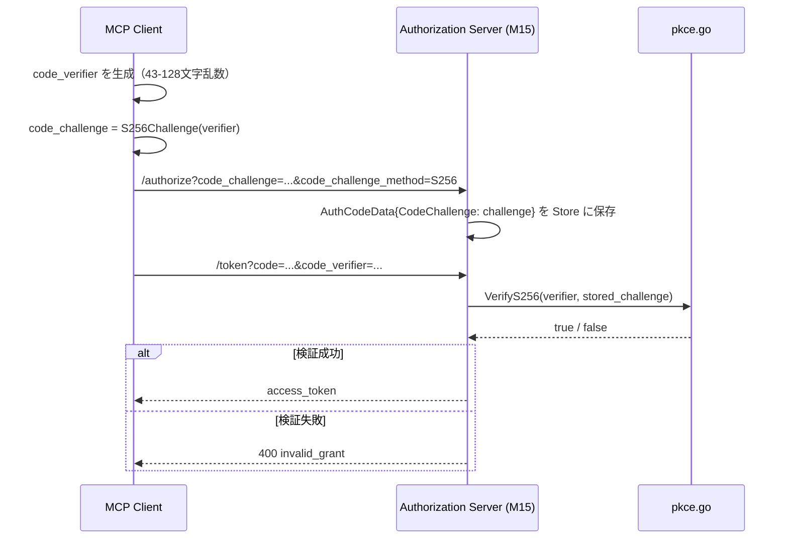

# マイルストーン M07: PKCE ユーティリティ

## 概要

RFC 7636 準拠の PKCE S256 コードチャレンジ生成・検証をルートパッケージに実装する。

## スコープ

### 実装範囲

- `pkce.go`: `S256Challenge(verifier string) string` — code_verifier から S256 チャレンジ生成
- `pkce.go`: `VerifyS256(verifier, challenge string) bool` — チャレンジ検証
- `pkce_test.go`: RFC 7636 付録 B のテストベクターを使用したテスト

### スコープ外

- plain メソッド（OAuth 2.1 で禁止）
- code_verifier のランダム生成（M15/M16 で実装）
- code_verifier の長さバリデーション（M15 で実装）

## テスト設計書

### RFC 7636 テストベクター（Appendix B）

```
code_verifier  = "dBjftJeZ4CVP-mB92K27uhbUJU1p1r_wW1gFWFOEjXk"
code_challenge = "E9Melhoa2OwvFrEMTJguCHaoeK1t8URWbuGJSstw-cM"
```

### 正常系ケース

| ID  | 関数                     | 入力                            | 期待出力                                         | 備考                           |
|-----|--------------------------|---------------------------------|--------------------------------------------------|--------------------------------|
| T01 | `S256Challenge`          | RFC 7636 Appendix B の verifier | `"E9Melhoa2OwvFrEMTJguCHaoeK1t8URWbuGJSstw-cM"` | パディングなし base64url        |
| T02 | `S256Challenge`          | 43文字の最短 verifier           | 43文字の base64url 文字列                        | SHA256→32byte→base64url=43char |
| T03 | `VerifyS256`             | 正しい verifier + challenge ペア | `true`                                           | RFC 7636 ベクター              |
| T04 | `VerifyS256`             | 誤った verifier                 | `false`                                          | 改ざん検出                     |
| T05 | `VerifyS256`             | 空文字 verifier                 | `false`                                          | 空 verifier の拒否             |
| T06 | `VerifyS256`             | 空文字 challenge                | `false`                                          | 空 challenge の拒否            |

### 異常系ケース

| ID  | 関数            | 入力                  | 期待動作       | 備考                          |
|-----|-----------------|-----------------------|----------------|-------------------------------|
| A01 | `S256Challenge` | 空文字列              | 空でない文字列 | SHA256("") も有効計算         |
| A02 | `VerifyS256`    | 不正な base64url文字列 | `false`        | デコードエラー = 検証失敗     |

### エッジケース

| ID  | 関数            | 入力                          | 期待動作  | 備考                    |
|-----|-----------------|-------------------------------|-----------|-------------------------|
| E01 | `S256Challenge` | 128文字の最長 verifier        | 正常生成  | RFC 7636 最大長          |
| E02 | `VerifyS256`    | challenge に `=` パディングあり | `false`   | base64url はパディングなし |

## 実装手順

### Step 1: Red — pkce_test.go を先に作成

- ファイル: `pkce_test.go`（新規）
- 内容:
  - `package idproxy` （ルートパッケージ）
  - RFC 7636 テストベクターを定数として定義
  - `TestS256Challenge` — 上記テストケース T01, T02, E01
  - `TestVerifyS256` — T03, T04, T05, T06, A02, E02
  - この時点では `pkce.go` が存在しないためコンパイルエラーになる（RED）

### Step 2: Green — pkce.go を最小実装

- ファイル: `pkce.go`（新規）
- 内容:
  - `package idproxy`
  - import: `"crypto/sha256"`, `"encoding/base64"`
  - `S256Challenge(verifier string) string`:
    ```go
    h := sha256.Sum256([]byte(verifier))
    return base64.RawURLEncoding.EncodeToString(h[:])
    ```
  - `VerifyS256(verifier, challenge string) bool`:
    ```go
    if verifier == "" || challenge == "" {
        return false
    }
    expected := []byte(S256Challenge(verifier))
    actual := []byte(challenge)
    return subtle.ConstantTimeCompare(expected, actual) == 1
    ```
  - import に `"crypto/subtle"` を追加
  - テストが全 GREEN になることを確認

### Step 3: Refactor

- コメント整備（Godoc スタイル）
- `go test -race ./...` で全 GREEN を確認
- `gofmt` フォーマット確認

## アーキテクチャ検討

### 既存パターンとの整合性

- パッケージ: ルートパッケージ `idproxy`（spec L939-940 で明示）
- ファイル命名: `pkce.go` / `pkce_test.go`（`config.go`, `user.go` と同パターン）
- コメント: 日本語 + Godoc スタイル（既存コードに準拠）
- エラー処理: bool 返却（内部ユーティリティのため `error` 不要）

### 外部依存

標準ライブラリのみ使用:
- `crypto/sha256`
- `crypto/subtle`（定数時間比較によるタイミング攻撃防止）
- `encoding/base64`

go.mod の変更なし。

### 関数シグネチャ

```go
// S256Challenge は RFC 7636 S256 メソッドでコードチャレンジを生成する。
// code_verifier を SHA-256 ハッシュし、base64url（パディングなし）でエンコードして返す。
func S256Challenge(verifier string) string

// VerifyS256 は RFC 7636 S256 メソッドでコードチャレンジを検証する。
// SHA256(verifier) の base64url が challenge と一致する場合に true を返す。
// verifier または challenge が空文字列の場合は false を返す。
func VerifyS256(verifier, challenge string) bool
```

## リスク評価

| リスク                              | 重大度 | 対策                                             |
|-------------------------------------|--------|--------------------------------------------------|
| base64 パディングによる検証失敗      | 中     | `base64.RawURLEncoding` を使用（パディングなし）  |
| plain メソッドの誤実装               | 高     | plain は実装しない。テストに「plain は存在しない」コメント追加 |
| 標準ライブラリの誤選択               | 低     | `encoding/base64.RawURLEncoding` が正しい選択    |
| タイミングサイドチャネル攻撃          | 中     | `crypto/subtle.ConstantTimeCompare` で定数時間比較 |

## シーケンス図



## チェックリスト（5観点27項目）

### 観点1: 実装実現可能性（5項目）

- [x] 手順の抜け漏れがないか（Red→Green→Refactor の流れが明確）
- [x] 各ステップが十分に具体的か（コードスニペット付き）
- [x] 依存関係が明示されているか（Step 1→2→3 の順序）
- [x] 変更対象ファイルが網羅されているか（pkce.go, pkce_test.go の2ファイル）
- [x] 影響範囲が正確に特定されているか（新規ファイルのみ、既存コードへの影響なし）

### 観点2: TDDテスト設計（6項目）

- [x] 正常系テストケースが網羅されているか（T01-T06）
- [x] 異常系テストケースが定義されているか（A01-A02）
- [x] エッジケースが考慮されているか（E01-E02）
- [x] 入出力が具体的に記述されているか（RFC 7636 テストベクター使用）
- [x] Red→Green→Refactorの順序が守られているか（Step 1-3 で明記）
- [x] モック/スタブの設計が適切か（外部依存なし、標準ライブラリのみ）

### 観点3: アーキテクチャ整合性（5項目）

- [x] 既存の命名規則に従っているか（`pkce.go` はスペック L939 に明示）
- [x] 設計パターンが一貫しているか（純粋関数、副作用なし）
- [x] モジュール分割が適切か（PKCE 専用ファイル）
- [x] 依存方向が正しいか（ルートパッケージ内、外部依存なし）
- [x] 類似機能との統一性があるか（user.go の純粋関数スタイルと一致）

### 観点4: リスク評価と対策（6項目）

- [x] リスクが適切に特定されているか（base64パディング、plain誤実装）
- [x] 対策が具体的か（RawURLEncoding 使用を明記）
- [x] フェイルセーフが考慮されているか（空文字列で false 返却）
- [x] パフォーマンスへの影響が評価されているか（SHA256 は高速、影響軽微）
- [x] セキュリティ観点が含まれているか（S256 固定、plain 禁止）
- [x] ロールバック計画があるか（新規ファイルのみ追加、削除で完全ロールバック可）

### 観点5: シーケンス図（5項目）

- [x] 正常フローが記述されているか（M15 との連携フロー）
- [x] エラーフローが記述されているか（検証失敗 → 400 invalid_grant）
- [x] ユーザー・システム間の相互作用が明確か
- [x] 同期的な処理の制御が明記されているか
- [x] 例外ハンドリングが図に含まれているか

---

## Next Action

> **このプランが承認されました。以下を順番に実行してください:**
>
> 1. `Skill(devflow:implement)` — このプランに基づいて実装を開始
>
> ユーザーの追加指示は不要です。即座に実行してください。
