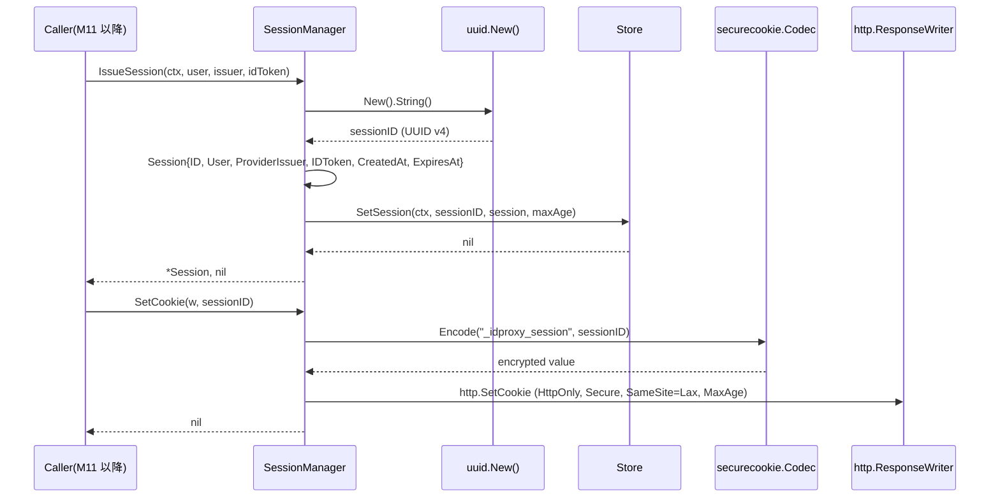
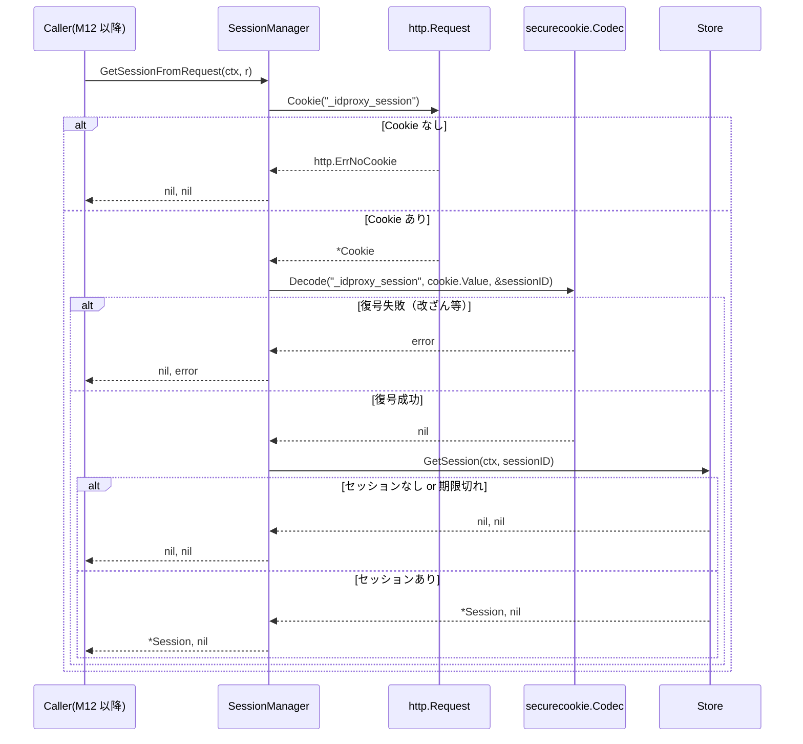
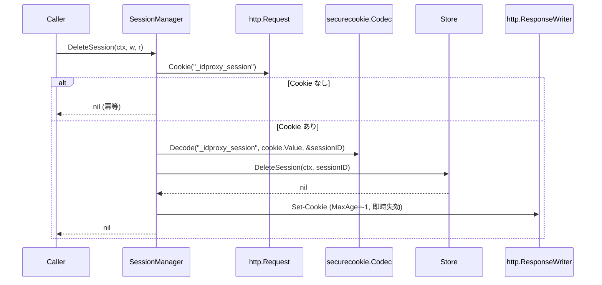

# マイルストーン M09: セッション管理（SessionManager）

## 概要

`session.go` に `SessionManager` 構造体を実装する。gorilla/securecookie による Cookie 暗号化と、Store インターフェース経由のセッション CRUD を TDD で構築する。

---

## スコープ

### 実装範囲
- `session.go`: `SessionManager` 構造体、`IssueSession`・`GetSession`・`DeleteSession`・`SetCookie`・`GetSessionFromRequest` メソッド
- `session_test.go`: 上記の全メソッドのテスト（TDD: Red → Green → Refactor）
- `go.mod` / `go.sum`: `gorilla/securecookie v1.x` と `github.com/google/uuid v1.x` を追加

### スコープ外
- Auth 構造体・Wrap() との接続（M12 で対応）
- OIDC コールバックでのセッション発行ロジック（M11 で対応）
- Redis Store 実装（Phase 2）

---

## 設計決定

### 配置: ルートパッケージ（`session.go`）

スペック `docs/specs/idproxy-spec.md` のディレクトリ構成（§11）に明記:
```
├── session.go     # SessionManager、Cookie 管理、暗号化 JWT
├── session_test.go
```
`SessionManager` はルートパッケージ `idproxy` に配置する。

### Cookie 名: `_idproxy_session`

スペック §8 フロー1 より:
```
Cookie: _idproxy_session=<encrypted-jwt>
```

### Cookie 暗号化方式

スペック ADR §6.2:
> Cookie + encrypted JWT でブラウザセッション管理。gorilla/securecookie で実績あり。

- `gorilla/securecookie` を使用
- `hashKey`: HMAC 用（CookieSecret を直接使用）
- `encryptionKey`: AES 用（CookieSecret の SHA-256 ハッシュ、32バイト）
- Codec: `securecookie.New(hashKey, encryptionKey)`

### セッション ID 生成: UUID v4

スペック §6 Session 型:
```go
// ID はセッションの一意識別子（UUID v4）。
ID string
```
→ `github.com/google/uuid` を使用。

### Cookie セキュリティ属性

スペック §9 セキュリティ要件:
```
Cookie セキュリティ | Secure, HttpOnly, SameSite=Lax 属性
```

- `HttpOnly: true`
- `Secure: true`（`cfg.ExternalURL` が `https://` の場合）
- `SameSite: http.SameSiteLaxMode`
- `MaxAge`: `SessionMaxAge` から秒数に変換

### Store との連携

セッションデータは Store にも保存する（Cookie の有効期限前でも強制ログアウトに対応）。

```
IssueSession: uuid生成 → Session{} 生成 → Store.SetSession → Cookie発行
GetSessionFromRequest: Cookie復号 → sessionID取得 → Store.GetSession → Session返却
DeleteSession: Store.DeleteSession → Cookie削除（MaxAge=-1）
```

---

## SessionManager API 設計

```go
// SessionManager は Cookie ベースのセッション管理を担当する。
type SessionManager struct {
    codec     securecookie.Codec
    store     Store
    maxAge    time.Duration
    secureCookie bool  // Secure属性: ExternalURLがhttps://の場合true
}

// NewSessionManager は新しい SessionManager を生成する。
func NewSessionManager(cfg Config) (*SessionManager, error)

// IssueSession は新しいセッションを発行し、Store に保存する。
// 返り値はセッション ID（UUID v4）。
func (sm *SessionManager) IssueSession(ctx context.Context, user *User, providerIssuer, idToken string) (*Session, error)

// SetCookie はセッション ID を暗号化して Set-Cookie ヘッダーを設定する。
func (sm *SessionManager) SetCookie(w http.ResponseWriter, sessionID string) error

// GetSessionFromRequest はリクエストの Cookie からセッションを取得する。
// Cookie が存在しない場合は nil, nil を返す（エラーではない）。
// Cookie が無効（改ざん等）の場合は nil, error を返す。
func (sm *SessionManager) GetSessionFromRequest(ctx context.Context, r *http.Request) (*Session, error)

// DeleteSession はセッションを削除し、Cookie を無効化する。
func (sm *SessionManager) DeleteSession(ctx context.Context, w http.ResponseWriter, r *http.Request) error
```

---

## テスト設計書（TDD: Red → Green → Refactor）

### Step 1: RED（先にテストを書く）

テストファイル `session_test.go` を先に作成し、コンパイルエラーを確認する。

#### 正常系テストケース

| ID | テスト名 | 入力 | 期待出力 | 備考 |
|----|---------|------|---------|------|
| T01 | NewSessionManager_正常 | 有効な Config（CookieSecret 32バイト） | `*SessionManager`, nil | |
| T02 | IssueSession_セッション発行 | User, providerIssuer, idToken | Session(IDがUUID形式), nilエラー | Store に保存確認 |
| T03 | IssueSession_ExpiresAt確認 | Config.SessionMaxAge=1h | Session.ExpiresAt ≈ now+1h | 誤差1秒以内 |
| T04 | SetCookie_Cookie発行 | 有効なsessionID | Set-Cookieヘッダー付きResponse | |
| T05 | GetSessionFromRequest_正常 | 有効Cookie付きRequest | 保存したSessionと同一 | |
| T06 | DeleteSession_削除 | 有効Cookie付きRequest | Store.GetSession=nil, MaxAge=-1のCookie | |

#### 異常系テストケース

| ID | テスト名 | 入力 | 期待エラー | 備考 |
|----|---------|------|----------|------|
| T07 | NewSessionManager_CookieSecret短すぎ | CookieSecret 16バイト | Validate()でエラー | Config.Validate()呼び出し側でキャッチ |
| T08 | GetSessionFromRequest_Cookie無し | Cookieなしのリクエスト | nil, nil | エラーではなく未認証扱い |
| T09 | GetSessionFromRequest_Cookie改ざん | 不正な値のCookie | nil, error | securecookieの復号エラー |
| T10 | GetSessionFromRequest_Store期限切れ | 有効なCookieだがStoreにセッション無し | nil, nil | Store側で期限切れ削除済み |
| T11 | SetCookie_securecookieエンコードエラー | 非常に大きなsessionID | error | エッジケース |

#### エッジケース

| ID | テスト名 | 備考 |
|----|---------|------|
| T12 | IssueSession_IDはUUID v4形式 | uuid.Parse でバリデーション |
| T13 | SetCookie_Secure属性確認 | ExternalURL が https:// の場合 true |
| T14 | SetCookie_HttpOnly属性確認 | 常に true |
| T15 | SetCookie_SameSite=Lax確認 | 常に Lax |

### Step 2: GREEN（最小実装）

テストが通る最小限の実装を `session.go` に行う。

### Step 3: REFACTOR（テストは緑のまま整理）

- 重複したエラーハンドリングの抽出
- Cookie セキュリティ属性の集約
- コメント整備

---

## 実装手順

### Step 1: go get で依存追加（RED 準備）

```bash
cd /Users/youyo/src/github.com/youyo/idproxy
go get github.com/gorilla/securecookie@latest
go get github.com/google/uuid@latest
```

依存: なし（最初に実行）

### Step 2: session_test.go 作成（RED）

- ファイル: `session_test.go`
- パッケージ: `package idproxy`
- `MemoryStore` を使用（`store/memory.go`）
- コンパイルエラーになることを確認: `go build ./...` → エラー必須

依存: Step 1

### Step 3: session.go スケルトン作成（GREEN 前準備）

- ファイル: `session.go`
- パッケージ: `package idproxy`
- import: `gorilla/securecookie`, `github.com/google/uuid`, `net/http`, `context`, `time`
- 空の関数シグネチャのみ記述してコンパイルエラーを解消

依存: Step 2

### Step 4: session.go 本実装（GREEN）

実装順:
1. `NewSessionManager`: CookieSecret から hashKey/encryptionKey 生成、securecookie.New
2. `IssueSession`: uuid.New().String() でID生成、Session{} 組み立て、Store.SetSession
3. `SetCookie`: securecookie.Encode → http.SetCookie（HttpOnly, Secure, SameSite=Lax）
4. `GetSessionFromRequest`: r.Cookie(cookieName) → securecookie.Decode → Store.GetSession
5. `DeleteSession`: Store.DeleteSession → MaxAge=-1 の Cookie を Set-Cookie

依存: Step 3

### Step 5: テスト実行・GREEN 確認

```bash
go test -race -v ./... 2>&1
```

依存: Step 4

### Step 6: Refactor（コード整理）

- Cookie セキュリティ属性を `newCookie()` ヘルパーに抽出
- エラーメッセージの統一

依存: Step 5（全テスト GREEN 確認後）

### Step 7: 最終テスト確認

```bash
go test -race ./...
```

依存: Step 6

---

## アーキテクチャ検討

### 既存パターンとの整合性

| 観点 | 既存パターン | M09 での対応 |
|------|------------|------------|
| ファイル配置 | ルートパッケージ（config.go, user.go 等） | session.go をルートパッケージに配置 |
| テストファイル | `*_test.go` でペアリング | session_test.go |
| コンストラクタ | `NewXxx(cfg Config) (*Xxx, error)` | NewSessionManager(cfg Config) (*SessionManager, error) |
| ctx エラーチェック | Store の各メソッドで `ctx.Err()` 確認 | Store に委譲しているため自動 |
| コメント | 日本語でフィールド説明 | 同様に日本語コメント |

### encryptionKey の生成方法

`CookieSecret` は32バイト以上が保証されているが、AES-256 は厳密に32バイトが必要。
`crypto/sha256` で `CookieSecret` をハッシュして32バイトを得る。

```go
import "crypto/sha256"

hashKey := cfg.CookieSecret
encKeyRaw := sha256.Sum256(cfg.CookieSecret)
encryptionKey := encKeyRaw[:]
```

### secureCookie フラグの決定

```go
secureCookie := strings.HasPrefix(cfg.ExternalURL, "https://")
```

Config.Validate() の後に呼ぶため ExternalURL は空でない。

---

## シーケンス図

### セッション発行フロー（IssueSession + SetCookie）



### セッション取得フロー（GetSessionFromRequest）



### セッション削除フロー（DeleteSession）



---

## リスク評価

| リスク | 重大度 | 対策 |
|--------|--------|------|
| CookieSecret が短い（32バイト未満） | 高 | Config.Validate() で32バイト未満を拒否済み |
| encryptionKey の派生が弱い | 中 | SHA-256 ハッシュで確定的32バイトを生成。秘密鍵はユーザーが管理 |
| gorilla/securecookie の API 変更 | 低 | v1.x は長期安定。go.mod で固定 |
| Cookie サイズ超過（4KB） | 低 | sessionID は UUID v4（36文字）のみCookieに格納。データは Store側 |
| Clock skew による有効期限の誤判定 | 低 | ExpiresAt は Store 側でも管理。二重チェック |
| セッション固定攻撃 | 中 | IssueSession で必ず新UUID生成（再利用なし） |
| ロールバック | 低 | session.go は新規ファイルのため削除のみで戻せる |

---

## 変更対象ファイル一覧

| ファイル | 種別 | 内容 |
|---------|------|------|
| `session.go` | 新規作成 | SessionManager 実装（ルートパッケージ） |
| `session_test.go` | 新規作成 | SessionManager テスト（TDD で先行作成） |
| `go.mod` | 更新 | gorilla/securecookie, google/uuid 追加 |
| `go.sum` | 更新 | 上記に対応するチェックサム |
| `plans/idproxy-roadmap.md` | 更新 | M09 チェックボックスを [x] に、Current Focus を M10 に変更 |

---

## 品質チェックリスト（5観点27項目）

### 観点1: 実装実現可能性と完全性

- [x] 手順の抜け漏れがないか（Step 1〜7 で端から端まで）
- [x] 各ステップが十分に具体的か（コマンドまで記載）
- [x] 依存関係が明示されているか（各ステップの依存を記載）
- [x] 変更対象ファイルが網羅されているか（上表参照）
- [x] 影響範囲が正確に特定されているか（M11/M12 への接続点を明示）

### 観点2: TDDテスト設計の品質

- [x] 正常系テストケースが網羅されているか（T01〜T06）
- [x] 異常系テストケースが定義されているか（T07〜T11）
- [x] エッジケースが考慮されているか（T12〜T15）
- [x] 入出力が具体的に記述されているか（テスト設計書参照）
- [x] Red→Green→Refactorの順序が守られているか（Step 2→4→6）
- [x] モック/スタブの設計が適切か（MemoryStore を使用）

### 観点3: アーキテクチャ整合性

- [x] 既存の命名規則に従っているか（NewXxx, Xxx パターン）
- [x] 設計パターンが一貫しているか（ルートパッケージ + Store DI）
- [x] モジュール分割が適切か（session.go が単一責務）
- [x] 依存方向が正しいか（SessionManager → Store インターフェース）
- [x] 類似機能との統一性があるか（config.go のコンストラクタパターンに従う）

### 観点4: リスク評価と対策

- [x] リスクが適切に特定されているか（6項目）
- [x] 対策が具体的か（各リスクに具体的対策）
- [x] フェイルセーフが考慮されているか（Cookie無しはnil,nilで安全に処理）
- [x] パフォーマンスへの影響が評価されているか（Cookie本体はIDのみ=36文字）
- [x] セキュリティ観点が含まれているか（HttpOnly, Secure, SameSite, UUID固定攻撃対策）
- [x] ロールバック計画があるか（新規ファイルのみ、削除で戻せる）

### 観点5: シーケンス図の完全性

- [x] 正常フローが記述されているか（3つのシーケンス図）
- [x] エラーフローが記述されているか（Cookie改ざん、Store期限切れ）
- [x] ユーザー・システム・外部API間の相互作用が明確か
- [x] タイミング・同期的な処理の制御が明記されているか
- [x] リトライ・タイムアウト等の例外ハンドリングが図に含まれているか

---

## ドキュメント更新

本マイルストーンでは以下のドキュメント更新が不要:
- `README.md`: M09 は内部実装。公開API（`Auth.Wrap()`）はM12で確定するため更新しない
- `docs/`: 新機能APIドキュメントはM12以降

更新対象:
- `plans/idproxy-roadmap.md`: M09 完了チェック + Current Focus → M10

---

## Next Action

> **このプランが承認されました。以下を順番に実行してください:**
>
> 1. `Skill(devflow:implement)` — このプランに基づいて実装を開始
>
> ユーザーの追加指示は不要です。即座に実行してください。

---

## Plan Footer

- spec: docs/specs/idproxy-spec.md
- roadmap: plans/idproxy-roadmap.md
- milestone: M09
- complexity: M
