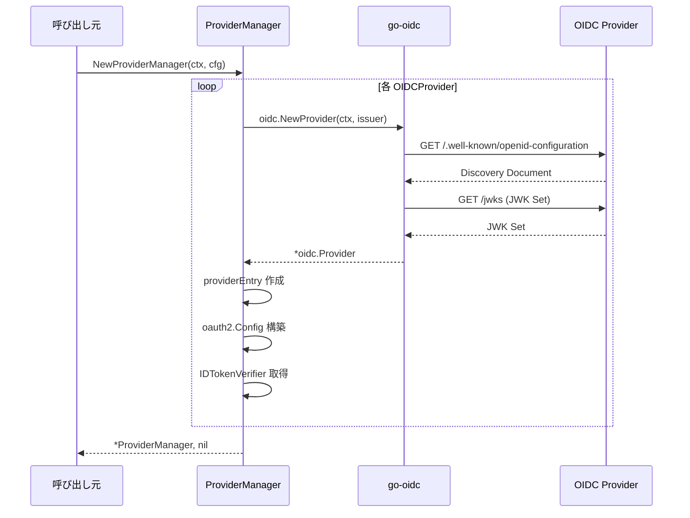
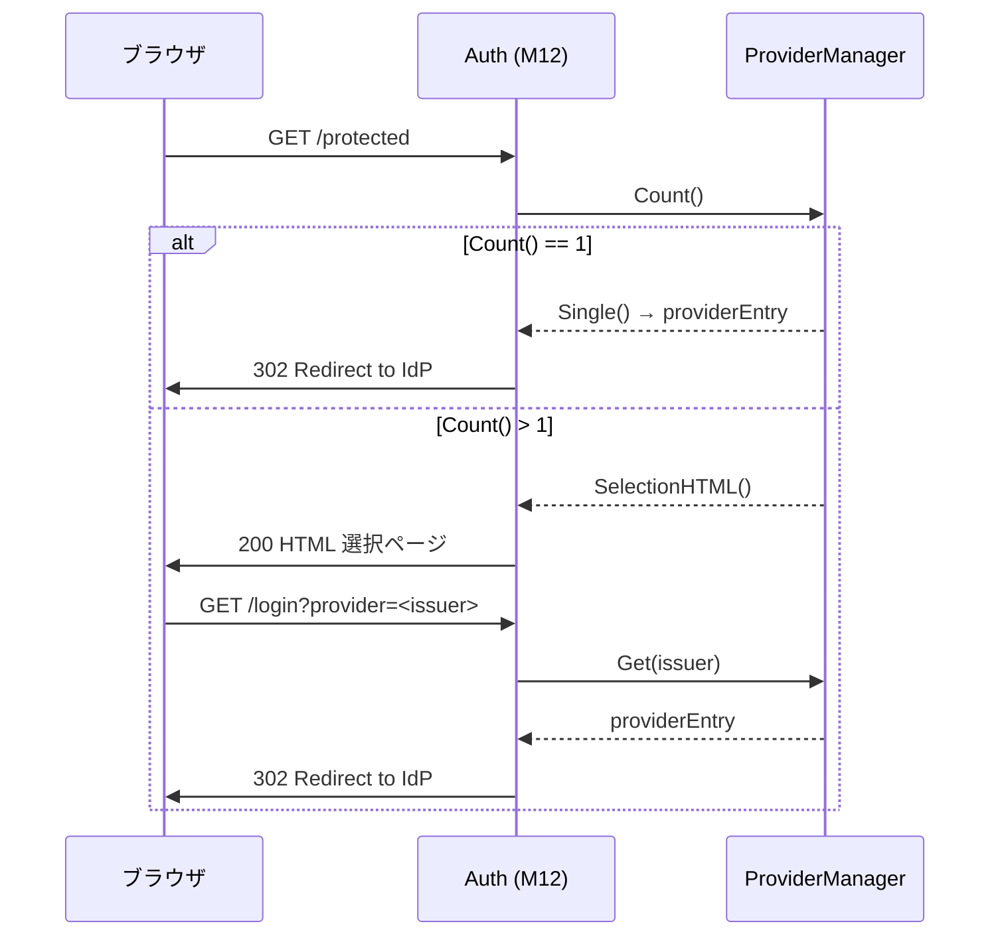
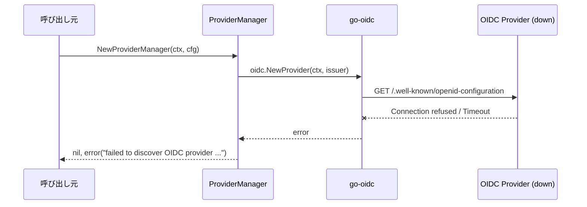

# マイルストーン M10: OIDC プロバイダー管理

## 概要

ProviderManager 構造体を実装し、go-oidc による OIDC Discovery の取得・キャッシュ、複数 IdP の初期化・管理、プロバイダー選択ロジックを提供する。

## スコープ

### 実装範囲

- `ProviderManager` 構造体（`provider.go`）
- OIDC Discovery 取得・キャッシュ（`coreos/go-oidc/v3` の `oidc.NewProvider`）
- 複数 IdP の初期化・管理（`[]OIDCProvider` → 内部マップ）
- プロバイダー選択ロジック（1つ → 直接リダイレクト情報返却、複数 → 選択ページ HTML 生成）
- プロバイダー選択 HTML ページ生成
- `oauth2.Config` の生成（各プロバイダー用）
- TDD: MockIdP での初期化テスト（`provider_test.go`）

### スコープ外

- 認証フロー自体の実装（M11 で実施）
- /callback ハンドラー（M11 で実施）
- Auth 構造体との統合（M12 で実施）
- Bearer Token 検証（M13 で実施）

## アーキテクチャ検討

### 既存パターンとの整合性

- `SessionManager` と同じパターン: `Config` を受け取り、構造体を返す `NewProviderManager(ctx, cfg) (*ProviderManager, error)`
- ファイル配置: スペック通り `provider.go` / `provider_test.go`（ルートパッケージ）
- エラーハンドリング: `fmt.Errorf` でラップ、複数エラーは最初の失敗で中断

### 新規モジュール設計

#### ProviderManager 構造体

```go
// ProviderManager は複数の OIDC プロバイダーを管理する。
type ProviderManager struct {
    providers map[string]*providerEntry  // key: Issuer URL
    order     []string                   // 設定順序を保持（選択ページ用）
    logger    *slog.Logger
}

// providerEntry は1つの OIDC プロバイダーの内部状態を保持する。
type providerEntry struct {
    config       OIDCProvider       // ユーザー設定
    oidcProvider *oidc.Provider     // go-oidc Provider（Discovery キャッシュ込み）
    oauth2Config oauth2.Config      // OAuth2 フロー用設定
    verifier     *oidc.IDTokenVerifier // ID Token 検証用
}
```

#### 主要メソッド

```go
// NewProviderManager は Config.Providers から ProviderManager を生成する。
// 各プロバイダーに対して OIDC Discovery を取得し、初期化を行う。
func NewProviderManager(ctx context.Context, cfg Config) (*ProviderManager, error)

// Get は Issuer URL に対応するプロバイダー情報を返す。
func (pm *ProviderManager) Get(issuer string) (*providerEntry, bool)

// List は設定順序でプロバイダー一覧を返す。
func (pm *ProviderManager) List() []OIDCProvider

// Count はプロバイダー数を返す。
func (pm *ProviderManager) Count() int

// Single は単一プロバイダーの場合にそのプロバイダーを返す。
// 複数の場合は nil, false を返す。
func (pm *ProviderManager) Single() (*providerEntry, bool)

// OAuth2Config は指定プロバイダーの oauth2.Config を返す。
func (pm *ProviderManager) OAuth2Config(issuer string) (*oauth2.Config, error)

// Verifier は指定プロバイダーの IDTokenVerifier を返す。
func (pm *ProviderManager) Verifier(issuer string) (*oidc.IDTokenVerifier, error)

// SelectionHTML は複数プロバイダー選択ページの HTML を生成する。
func (pm *ProviderManager) SelectionHTML() string
```

### go-oidc の利用方針

- `oidc.NewProvider(ctx, issuerURL)` で Discovery を自動取得
- go-oidc 内蔵の JWKS キャッシュを活用（追加キャッシュ層は不要）
- `provider.Verifier()` で `IDTokenVerifier` を取得
- `provider.Endpoint()` で Authorization/Token エンドポイントを取得

### プロバイダー選択ロジック

```
プロバイダー数判定:
  1つ → Single() で直接返却（呼び出し側がリダイレクト）
  2つ以上 → SelectionHTML() で選択ページ HTML を生成
```

### プロバイダー名の自動生成

`OIDCProvider.Name` が空の場合、Issuer URL から自動生成:
- `https://accounts.google.com` → `Google`
- `https://login.microsoftonline.com/...` → `Microsoft`
- その他 → ホスト名部分を使用

## テスト設計書

### Red → Green → Refactor サイクル

#### サイクル 1: NewProviderManager 基本初期化

**Red**: 単一プロバイダーで ProviderManager を作成できるテスト

| ID | テストケース | 入力 | 期待出力 | 備考 |
|----|------------|------|---------|------|
| T01 | 単一プロバイダー初期化成功 | MockIdP 1つ, Config with 1 Provider | err == nil, Count() == 1 | MockIdP の Discovery エンドポイントに接続 |
| T02 | 複数プロバイダー初期化成功 | MockIdP 2つ, Config with 2 Providers | err == nil, Count() == 2 | 2つの MockIdP を起動 |

**Green**: `NewProviderManager` で `oidc.NewProvider` を呼び出し、map に格納

**Refactor**: 内部ヘルパーの抽出

#### サイクル 2: プロバイダー取得

**Red**: Get/List/Single メソッドのテスト

| ID | テストケース | 入力 | 期待出力 | 備考 |
|----|------------|------|---------|------|
| T03 | Get で既存プロバイダー取得 | 存在する Issuer URL | entry != nil, ok == true | |
| T04 | Get で未存在プロバイダー | 存在しない Issuer URL | entry == nil, ok == false | |
| T05 | List で設定順序を保持 | 2つのプロバイダー | 設定順序と一致する []OIDCProvider | |
| T06 | Single: 1プロバイダー | Count() == 1 | entry != nil, ok == true | |
| T07 | Single: 複数プロバイダー | Count() == 2 | entry == nil, ok == false | |

**Green**: map/slice 操作で実装

**Refactor**: 不要

#### サイクル 3: OAuth2Config / Verifier 取得

**Red**: OAuth2Config / Verifier メソッドのテスト

| ID | テストケース | 入力 | 期待出力 | 備考 |
|----|------------|------|---------|------|
| T08 | OAuth2Config 取得成功 | 存在する Issuer | RedirectURL, ClientID, Scopes が正しい | |
| T09 | OAuth2Config 未存在 Issuer | 存在しない Issuer | error | |
| T10 | Verifier 取得成功 | 存在する Issuer | verifier != nil, err == nil | |
| T11 | Verifier 未存在 Issuer | 存在しない Issuer | error | |
| T12 | デフォルトスコープの適用 | Scopes 未指定の Provider | ["openid", "email", "profile"] | Config.Validate() で適用済み |

**Green**: providerEntry のフィールドを返却

**Refactor**: エラーメッセージの統一

#### サイクル 4: プロバイダー名自動生成

**Red**: Name フィールドの自動生成テスト

| ID | テストケース | 入力 | 期待出力 | 備考 |
|----|------------|------|---------|------|
| T13 | Name 指定あり | Name: "My IdP" | "My IdP" | そのまま使用 |
| T14 | Name 未指定 - Google | Issuer: "https://accounts.google.com" | "Google" | 既知 Issuer のマッピング |
| T15 | Name 未指定 - Microsoft | Issuer: "https://login.microsoftonline.com/..." | "Microsoft" | 既知 Issuer のマッピング |
| T16 | Name 未指定 - 未知 | Issuer: MockIdP URL | ホスト名部分 | URL パース |

**Green**: `resolveProviderName` ヘルパー関数

**Refactor**: 既知 Issuer マッピングをテーブルに

#### サイクル 5: 選択ページ HTML 生成

**Red**: SelectionHTML メソッドのテスト

| ID | テストケース | 入力 | 期待出力 | 備考 |
|----|------------|------|---------|------|
| T17 | 複数プロバイダーの HTML 生成 | 2つのプロバイダー | 各プロバイダー名を含む HTML | html/template で安全に生成 |
| T18 | HTML に Issuer がパラメータとして含まれる | 2つのプロバイダー | `?provider=<issuer>` 形式のリンク | XSS 対策 |
| T19 | HTML が有効な HTML5 | - | DOCTYPE, html, head, body タグを含む | |

**Green**: `html/template` でテンプレート生成

**Refactor**: テンプレートの外部化検討（結局 embed で内包が適切）

#### サイクル 6: エラーケース

**Red**: 初期化失敗のテスト

| ID | テストケース | 入力 | 期待出力 | 備考 |
|----|------------|------|---------|------|
| T20 | Discovery 取得失敗 | 無効な Issuer URL | error 含む "failed to discover" | |
| T21 | プロバイダーリスト空 | Providers: [] | error | Config.Validate() で弾かれるが念のため |
| T22 | コンテキストキャンセル | ctx.Done() 済み | context.Canceled error | |

**Green**: エラーハンドリング追加

**Refactor**: エラーメッセージの一貫性

### 異常系テストケース（まとめ）

| ID | 入力 | 期待エラー | 備考 |
|----|------|----------|------|
| T20 | 無効な Issuer URL | "failed to discover OIDC provider" | ネットワークエラー |
| T21 | 空の Providers | "at least one provider is required" | バリデーション |
| T22 | キャンセル済み context | context.Canceled | タイムアウト |

## 実装手順

### Step 1: 依存追加

- ファイル: `go.mod`
- 概要: `github.com/coreos/go-oidc/v3` と `golang.org/x/oauth2` を追加
- コマンド: `go get github.com/coreos/go-oidc/v3/oidc golang.org/x/oauth2`
- 依存: なし

### Step 2: providerEntry 型と ProviderManager 構造体定義（Red → Green）

- ファイル: `provider.go`, `provider_test.go`
- 概要: 構造体定義と `NewProviderManager` の TDD
- TDD サイクル: サイクル 1（T01, T02）
- 依存: Step 1

### Step 3: Get/List/Count/Single メソッド（Red → Green）

- ファイル: `provider.go`, `provider_test.go`
- 概要: プロバイダー取得メソッドの TDD
- TDD サイクル: サイクル 2（T03-T07）
- 依存: Step 2

### Step 4: OAuth2Config/Verifier メソッド（Red → Green）

- ファイル: `provider.go`, `provider_test.go`
- 概要: OAuth2 設定と ID Token 検証器の取得
- TDD サイクル: サイクル 3（T08-T12）
- 依存: Step 3

### Step 5: プロバイダー名自動生成（Red → Green）

- ファイル: `provider.go`, `provider_test.go`
- 概要: `resolveProviderName` ヘルパー関数の TDD
- TDD サイクル: サイクル 4（T13-T16）
- 依存: Step 2

### Step 6: 選択ページ HTML 生成（Red → Green）

- ファイル: `provider.go`, `provider_test.go`
- 概要: `SelectionHTML` メソッドの TDD
- TDD サイクル: サイクル 5（T17-T19）
- 依存: Step 3

### Step 7: エラーケース（Red → Green）

- ファイル: `provider_test.go`
- 概要: 異常系テストの追加
- TDD サイクル: サイクル 6（T20-T22）
- 依存: Step 2

### Step 8: Refactor

- ファイル: `provider.go`
- 概要: 全テスト Green の状態でコード品質改善
- 依存: Step 2-7 全て完了

### Step 9: ドキュメント更新

- ファイル: `plans/idproxy-roadmap.md`
- 概要: M10 のチェックボックスを完了にマーク
- 依存: Step 8

## シーケンス図

### NewProviderManager 初期化フロー



### プロバイダー選択フロー



### エラーフロー: Discovery 失敗



## リスク評価

| リスク | 重大度 | 対策 |
|--------|--------|------|
| go-oidc の Discovery がテスト中にタイムアウト | 中 | MockIdP は httptest.Server で即応答するため低リスク。テストに context.WithTimeout を設定 |
| go-oidc v3 の API 変更 | 低 | v3.x は安定版。go.sum でバージョン固定 |
| 選択ページ HTML の XSS | 高 | html/template の自動エスケープ機能を使用。テストで確認 |
| 複数 IdP の Discovery 並列化によるレースコンディション | 中 | 初期化は直列で実施（起動時のみの処理のため速度は問題にならない） |
| MockIdP が go-oidc の期待する Discovery 形式と不一致 | 中 | MockIdP は既に標準形式を実装済み。テストで検証 |
| ExternalURL から callbackURL 構築のパス管理 | 低 | PathPrefix を考慮した URL 構築。M11 で本格対応 |

### ロールバック計画

- provider.go / provider_test.go は新規ファイルのため、削除で完全ロールバック可能
- go.mod の依存追加は `go mod tidy` で未使用分を除去可能

## チェックリスト

### 観点1: 実装実現可能性と完全性（5項目）

- [x] 手順の抜け漏れがないか: Step 1-9 で依存追加 → TDD → リファクタ → ドキュメント更新まで網羅
- [x] 各ステップが十分に具体的か: ファイル名、メソッド名、テストケース ID まで明記
- [x] 依存関係が明示されているか: 各 Step に依存を記載
- [x] 変更対象ファイルが網羅されているか: provider.go, provider_test.go, go.mod, go.sum, plans/idproxy-roadmap.md
- [x] 影響範囲が正確に特定されているか: 新規ファイル2つ + 依存追加のみ。既存コードへの変更なし

### 観点2: TDDテスト設計の品質（6項目）

- [x] 正常系テストケースが網羅されているか: T01-T19 で全メソッドをカバー
- [x] 異常系テストケースが定義されているか: T20-T22
- [x] エッジケースが考慮されているか: 空プロバイダー、未存在 Issuer、コンテキストキャンセル
- [x] 入出力が具体的に記述されているか: 各テストケースに入力/期待出力を明記
- [x] Red→Green→Refactorの順序が守られているか: サイクル 1-6 で明示
- [x] モック/スタブの設計が適切か: testutil.MockIdP を活用

### 観点3: アーキテクチャ整合性（5項目）

- [x] 既存の命名規則に従っているか: SessionManager と同じ命名パターン
- [x] 設計パターンが一貫しているか: Config → New → 構造体パターンを踏襲
- [x] モジュール分割が適切か: ルートパッケージに配置（スペック通り）
- [x] 依存方向が正しいか: idproxy → go-oidc, x/oauth2（外向き依存のみ）
- [x] 類似機能との統一性があるか: SessionManager と同じ初期化パターン

### 観点4: リスク評価と対策（6項目）

- [x] リスクが適切に特定されているか: 6項目を評価
- [x] 対策が具体的か: 各リスクに具体的な対策を記載
- [x] フェイルセーフが考慮されているか: Discovery 失敗時は即座にエラー返却
- [x] パフォーマンスへの影響が評価されているか: 初期化時のみの処理、go-oidc キャッシュ活用
- [x] セキュリティ観点が含まれているか: XSS 対策、html/template 使用
- [x] ロールバック計画があるか: 新規ファイル削除で完全ロールバック

### 観点5: シーケンス図の完全性（5項目）

- [x] 正常フローが記述されているか: 初期化フロー、選択フロー
- [x] エラーフローが記述されているか: Discovery 失敗フロー
- [x] ユーザー・システム・外部API間の相互作用が明確か: Browser ↔ Auth ↔ PM ↔ IdP
- [x] タイミング・同期的な処理の制御が明記されているか: 直列初期化を明記
- [x] リトライ・タイムアウト等の例外ハンドリングが図に含まれているか: Discovery 失敗をシーケンス図で表現

## ドキュメント更新

- `plans/idproxy-roadmap.md`: M10 のチェックボックスを `[x]` に更新
- CHANGELOG: M10 完了のエントリ追加（ロードマップ内 Changelog セクション）

---

## Next Action

> **このプランが承認されたら、以下を順番に実行してください:**
>
> 1. `Skill(devflow:implement)` -- このプランに基づいて実装を開始
>
> ユーザーの追加指示は不要です。即座に実行してください。
