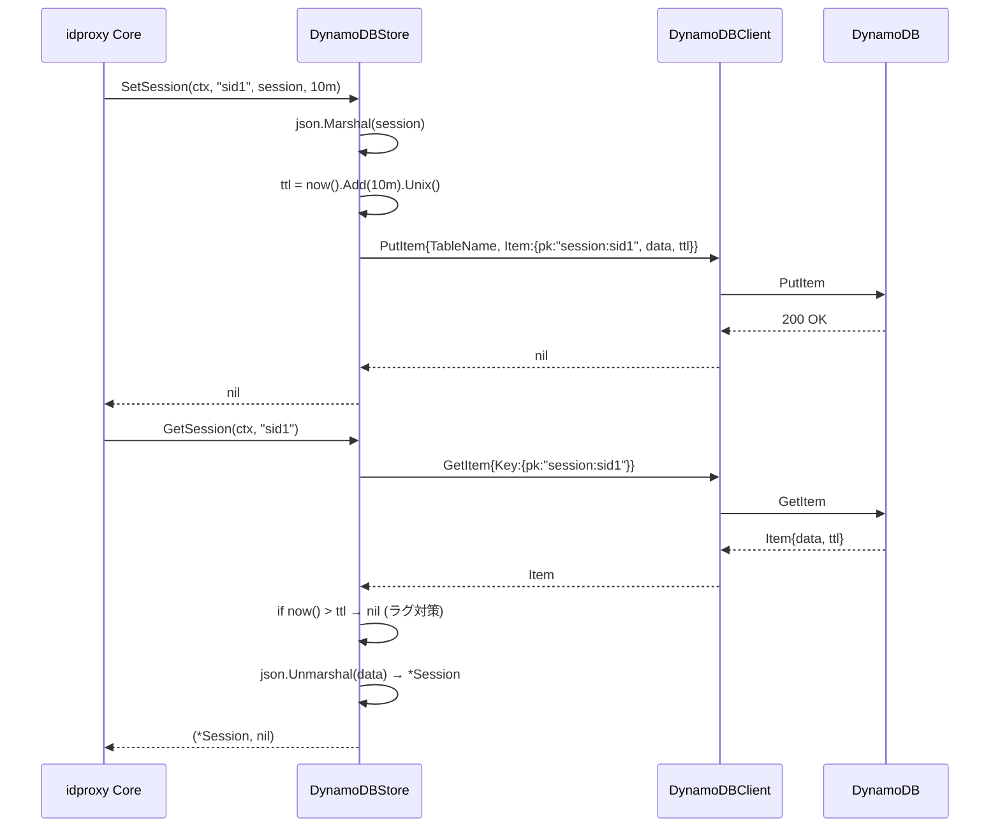
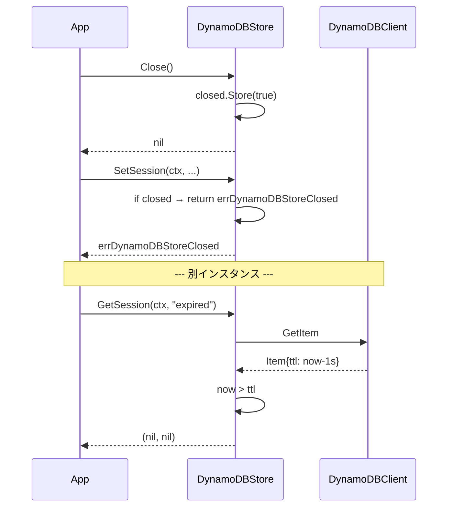

# マイルストーン M21: DynamoDB Store 実装 (v0.2.0)

## Context

`logvalet mcp` を AWS Lambda (Function URL) にマルチコンテナで運用する際、`idproxy.Store` 実装が `MemoryStore` のみのためコンテナ間で DCR クライアント / 認可コード / セッション / アクセストークン(JTI) が共有されず、Claude.ai 等から並行リクエストで `redirect_uri is not allowed` / `invalid_client` / 401 が発生する。現状は `reserved-concurrent-executions=1` の回避運用で、コールドスタート跨ぎでも状態が消失する。

本マイルストーンは idproxy 側の根本対応として **DynamoDB ベースの `idproxy.Store` 実装を追加し、v0.2.0 としてリリース**する。logvalet 側の `BuildAuthConfig` 改修 (serene-whistling-wirth.md) は本リリースを前提に別途実施される。

**スコープ**: idproxy 側のみ。logvalet 側は本タスクの対象外。

### 依頼元要件 (logvalet/plans/idproxy-dynamodb-store-request.md)
- 新規ファイル `store/dynamodb.go` で `idproxy.Store` を実装
- 既存 `MemoryStore` と 100% 同じ API (非互換変更なし)
- mock 注入版コンストラクタ `NewDynamoDBStoreWithClient` を提供
- テーブル構造: PK `pk` (String), TTL `ttl` (Number), 値 `data`
- ユニットテスト (既存 `memory_test.go` と同シナリオ)
- v0.2.0 タグ + GitHub Release + README 追記

## スコープ

### 実装範囲
1. `store/dynamodb.go` — `DynamoDBStore` 型 + 2 コンストラクタ + 10 メソッド (`Store` interface 完全実装)
2. `store/dynamodb_test.go` — mock ベースのユニットテスト (CRUD + TTL + 並行性)
3. `store/doc.go` — パッケージドキュメントに DynamoDB Store を追記
4. `README.md` / `README_ja.md` — DynamoDB Store 使用例とテーブル作成 CloudFormation / `aws dynamodb create-table` コマンド例
5. `CHANGELOG.md` — v0.2.0 エントリ追加 (新規ファイル or 既存ファイル末尾追記)
6. `plans/idproxy-roadmap.md` — M21 セクション追加
7. `go.mod` / `go.sum` — `aws-sdk-go-v2/config`, `aws-sdk-go-v2/service/dynamodb` 依存追加
8. GitHub Release `v0.2.0` タグ作成

### スコープ外
- Redis / Postgres Store 対応 (将来の別マイルストーン)
- signing key ローテーション機構 (logvalet 側で PEM 環境変数注入)
- logvalet 側 `BuildAuthConfig` 改修 (別リポジトリ、別 Plan)
- DynamoDB Local を使った E2E 統合テスト (mock 注入で十分。将来追加可)
- 既存 `MemoryStore` への変更 (後方非互換ゼロ)

## テーブル設計

| 属性 | 型 | 必須 | 用途 |
|------|----|------|------|
| `pk` | String (HASH) | ✓ | パーティションキー。`session:<id>`, `authcode:<code>`, `accesstoken:<jti>`, `client:<client_id>` 形式 |
| `data` | String | ✓ | エンティティの JSON シリアライズ (`encoding/json`) |
| `ttl` | Number | セッション/認可コード/アクセストークンのみ | Unix epoch 秒。DynamoDB TTL 属性。Client は TTL なし |

**単一テーブル設計**: 4 種類のエンティティを PK プレフィクスで名前空間分離。

**DynamoDB TTL のラグ対策**: DynamoDB の TTL バックグラウンド削除は最大 48 時間遅れるため、Get 時に取得したアイテムの `ttl` を `time.Now().Unix()` と比較し、期限切れなら `nil, nil` を返す (MemoryStore と同等の即時期限切れセマンティクス)。

**強整合性読み込み (ConsistentRead) の適用方針**: 本 Store の主目的は Lambda マルチコンテナ環境で「書き込んだコンテナと別のコンテナが即座に読む」race を解消することなので、書き込み直後読み込みがクリティカルなキーには `ConsistentRead: true` をデフォルト適用する。

| エンティティ | ConsistentRead | 理由 |
|-------------|----------------|------|
| `GetAuthCode` | **true** | `/authorize` と `/token` が別コンテナになり、発行直後 (<1s) に読み込み → eventual では `invalid_grant` race |
| `GetSession` | **true** | ログイン直後のリダイレクト先が別コンテナの場合に session miss を防ぐ |
| `GetClient` | false | DCR 登録→初回利用までに十分な間隔あり。コスト最適化 |
| `GetAccessToken` | false | トークン発行直後の利用は通常 5-10 分後以降 (リボケーションチェックは eventual 許容) |

コスト影響: 該当 2 種は RCU が 2 倍だがセッション/認可コードのワークロードでは絶対量が小さく無視可能。

## アーキテクチャ検討

### 既存パターンとの整合性
- **インターフェース準拠**: `var _ idproxy.Store = (*DynamoDBStore)(nil)` で静的検証 (`memory.go:14` と同パターン)
- **mock 注入**: logvalet の `internal/auth/tokenstore/dynamodb.go` と同一パターン
  - インターフェース名: `DynamoDBClient` (要件に合わせる。logvalet は `DynamoDBAPI` だが本パッケージ内の命名統一を優先)
  - 必要メソッド: `GetItem`, `PutItem`, `DeleteItem` (`Cleanup` は TTL 任せで Scan 不要)
- **エラー返却**: `fmt.Errorf("dynamodb store: <op>: %w", err)` プレフィクス統一
- **コメント**: 日本語 (既存コードベース規約)
- **存在しないキーの扱い**: MemoryStore と同じく `(nil, nil)` を返す (エラーではない)。`DeleteXxx` も冪等

### 新規モジュール設計

```
store/
├── doc.go              (既存、追記)
├── memory.go           (既存、変更なし)
├── memory_test.go      (既存、変更なし)
├── dynamodb.go         (新規) ← 本Plan
└── dynamodb_test.go    (新規) ← 本Plan
```

### `DynamoDBClient` インターフェース

```go
type DynamoDBClient interface {
    GetItem(ctx context.Context, params *dynamodb.GetItemInput, optFns ...func(*dynamodb.Options)) (*dynamodb.GetItemOutput, error)
    PutItem(ctx context.Context, params *dynamodb.PutItemInput, optFns ...func(*dynamodb.Options)) (*dynamodb.PutItemOutput, error)
    DeleteItem(ctx context.Context, params *dynamodb.DeleteItemInput, optFns ...func(*dynamodb.Options)) (*dynamodb.DeleteItemOutput, error)
}
```

### `DynamoDBStore` 構造体

```go
type DynamoDBStore struct {
    client    DynamoDBClient
    tableName string
    now       func() time.Time  // テスト時に時刻を注入。本番は time.Now
    closeOnce sync.Once
    closed    atomic.Bool        // Close 後の操作ブロック用
}
```

### キー生成ヘルパー

```go
func sessionPK(id string) string      { return "session:" + id }
func authCodePK(code string) string   { return "authcode:" + code }
func accessTokenPK(jti string) string { return "accesstoken:" + jti }
func clientPK(clientID string) string { return "client:" + clientID }
```

### シリアライズ / デシリアライズ

- `json.Marshal(entity)` → `data` 属性 (String)
- `json.Unmarshal([]byte(data), &entity)` で復元
- `time.Time` は Go 標準の RFC3339Nano JSON フォーマットで十分
- `*User` ポインタは `json:",omitempty"` 属性があれば存在に応じてシリアライズ (既存型を変更しない)

## 実装手順 (TDD)

### Step 1: 依存追加 (Red の前提準備)
- ファイル: `go.mod`, `go.sum`
- コマンド: `go get github.com/aws/aws-sdk-go-v2/config@latest github.com/aws/aws-sdk-go-v2/service/dynamodb@latest`
- 依存: なし
- 備考: `go mod tidy` で不要な indirect も整理

### Step 2: Red — mock テストファイル骨格作成
- ファイル: `store/dynamodb_test.go`
- 概要:
  - `fakeDynamoDBClient` 実装 (map-backed in-memory, thread-safe)
    - `items map[string]map[string]types.AttributeValue` (`pk` → full item)
    - `sync.Mutex`
    - エラー注入フック (`getItemErr`, `putItemErr`, `deleteItemErr` フィールド)
  - 各テストで `NewDynamoDBStoreWithClient` を使用
  - `memory_test.go` から主要ケースを移植
- 依存: Step 1
- 備考: この時点で `go test ./store/...` は **コンパイルエラー** → Red

### Step 3: Green — `store/dynamodb.go` 最小実装
- ファイル: `store/dynamodb.go`
- 概要: 以下の順で実装
  1. `DynamoDBClient` インターフェース + コンパイルタイム `var _ idproxy.Store = (*DynamoDBStore)(nil)`
  2. `NewDynamoDBStore(tableName, region string) (*DynamoDBStore, error)` — AWS SDK v2 の `config.LoadDefaultConfig` + `dynamodb.NewFromConfig`
  3. `NewDynamoDBStoreWithClient(client DynamoDBClient, tableName string) *DynamoDBStore`
  4. 3種類のエンティティ CRUD + TTL (session/authcode/accesstoken)
     - `SetXxx`: `PutItem` with `pk`, `data` (JSON), `ttl` (unix秒)
     - `GetXxx`: `GetItem` → JSON unmarshal → TTL 検証 (ラグ対策)
     - `DeleteXxx`: `DeleteItem` (冪等)
  5. Client CRUD (TTL なし)
  6. `Cleanup(ctx)` — no-op (DynamoDB TTL に委譲) + ドキュメントコメント
  7. `Close()` — `closed` フラグを立てる no-op (冪等)
  8. 全メソッド先頭で `if s.closed.Load()` チェック
- 依存: Step 2
- 備考: この時点で `go test ./store/...` が **緑** → Green

### Step 4: Refactor — ヘルパー関数抽出
- ファイル: `store/dynamodb.go`
- 概要:
  - `getItemJSON[T any](ctx, pk) (*T, bool, error)` ジェネリック取得ヘルパー (TTL チェック込み)
  - `putItemJSON(ctx, pk string, v any, ttl time.Duration) error` ヘルパー
  - `deleteItem(ctx, pk string) error` ヘルパー
  - `attrString`, `attrNumber` 等の属性生成ヘルパー
- 依存: Step 3
- 備考: テストは緑のまま維持

### Step 5: ドキュメント更新
- ファイル: `store/doc.go`, `README.md`, `README_ja.md`
- 概要:
  - `doc.go` に DynamoDB Store の役割を追記 (MemoryStore との使い分け)
  - `README.md` に以下セクションを追加:
    - DynamoDB Store 使用例 (コード片)
    - テーブル作成 CLI 例 (`aws dynamodb create-table`) — PK, TTL 有効化
    - IAM 権限例 (GetItem/PutItem/DeleteItem)
  - `README_ja.md` にも同等内容を日本語で追加
- 依存: Step 3 (API 確定後)

### Step 6: CHANGELOG + ロードマップ更新
- ファイル: `CHANGELOG.md` (新規 or 追記), `plans/idproxy-roadmap.md`
- 概要:
  - `CHANGELOG.md` v0.2.0 セクション: "feat(store): DynamoDB Store 実装追加 — Lambda マルチインスタンス環境対応"
  - ロードマップに M21 を完了済みマークで追加

### Step 7: 全体テスト + Vet + Lint
- コマンド:
  ```
  go mod tidy
  go test ./... -race
  go vet ./...
  golangci-lint run  # v2 系、既存設定に従う
  ```
- 依存: Step 3-6

### Step 8: v0.2.0 リリース
- コマンド:
  ```
  git tag v0.2.0
  git push origin v0.2.0
  gh release create v0.2.0 --generate-notes  # or /release skill
  ```
- 依存: Step 7 が全緑
- 備考: goreleaser の homebrew test が `idproxy --help` を実行する (memory 25028 より)。DynamoDB 追加は CLI の起動挙動を変えない想定だが、ローカルで `go run ./cmd/idproxy --help` 動作確認必須

## テスト設計書

### 正常系ケース (CRUD × 4 エンティティ)

| ID | 対象 | 入力 | 期待出力 | 備考 |
|-----|-----|--------|------|------|
| N01 | Session | `SetSession(id="sess-1", session, 10m)` → `GetSession("sess-1")` | 同一 `*Session` 値 | JSON round-trip 検証 |
| N02 | Session | `SetSession` → `DeleteSession` → `GetSession` | `(nil, nil)` | 削除冪等 |
| N03 | Session | 存在しない ID を `GetSession` | `(nil, nil)` | エラーではない |
| N04 | Session | 存在しない ID を `DeleteSession` | `nil` エラー | 冪等 |
| N05 | AuthCode | N01-N04 同等 (`SetAuthCode`/`GetAuthCode`/`DeleteAuthCode`) | 同上 | `AuthCodeData.Used` 保持 |
| N06 | AccessToken | N01-N04 同等 | 同上 | `AccessTokenData.Revoked` 保持 |
| N07 | Client | `SetClient("cid", data)` → `GetClient` → `DeleteClient` | 同一 `*ClientData` | TTL なしパス |
| N08 | Upsert | `SetSession` 2 回 (同一 ID、異なる値) | 2 回目の値が取得される | 上書き |

### TTL ケース

| ID | 入力 | 期待出力 | 備考 |
|-----|-----|--------|------|
| T01 | `SetSession("x", _, 1ns)` → 時刻進めて `GetSession` | `(nil, nil)` | `now` 関数注入で決定論的に |
| T02 | `SetAuthCode("x", _, 0)` → `GetAuthCode` | `(nil, nil)` | 即期限切れ |
| T03 | `SetAccessToken("x", _, 1h)` → `now + 30m` で `GetAccessToken` | 有効なデータ | 境界内 |
| T04 | DynamoDB TTL 属性が `PutItem` 時に `ttl` (Number) として設定されること | `fakeDynamoDBClient` が受け取った item を assert | 属性検証 |

### 異常系ケース

| ID | 入力 | 期待エラー | 備考 |
|-----|-----|----------|------|
| E01 | `GetItem` が AWS API エラーを返す | `error` wrap (`dynamodb store: get session:` で始まる) | errors.Is 検証 |
| E02 | `PutItem` エラー | `error` wrap | |
| E03 | `DeleteItem` エラー | `error` wrap | |
| E04 | `GetItem` が item を返すが `data` が不正 JSON | `error` wrap (unmarshal エラー) | |
| E05 | `ctx.Err() != nil` (キャンセル済み) | `ctx.Err()` そのまま返却 | 全 CRUD メソッドで |
| E06 | `Close()` 後に `SetSession` 呼び出し | `errDynamoDBStoreClosed` | `atomic.Bool` チェック |
| E07 | `Close()` を 2 回呼び出し | 2 回とも `nil` | 冪等 |

### 並行アクセスケース

| ID | シナリオ | 期待出力 | 備考 |
|-----|---------|--------|------|
| C01 | 100 goroutine が同一 `DynamoDBStore` に対し異なる PK で `SetSession` | race なし、全件取得可能 | `go test -race` |
| C02 | 50 goroutine が `SetClient` + 50 goroutine が `GetClient` (別 PK) | race なし | |

### エッジケース

| ID | 入力 | 期待出力 | 備考 |
|-----|-----|--------|------|
| G01 | PK に `:` を含む ID (例: `sess-a:b`) | 正常動作 | プレフィクスとのコリジョンなし (`session:sess-a:b` として保存) |
| G02 | 空文字列 ID (`""`) | 正常動作 or エラー | 現 MemoryStore は空文字列を受け付けるため同挙動 |
| G03 | `Cleanup(ctx)` を呼び出し | `nil` (no-op) | コメントで TTL 委譲を明示 |

### TDD 実行順序
1. Step 2 でテストを先に書く → コンパイルエラー (Red)
2. Step 3 で最小実装 → 全緑 (Green)
3. Step 4 でリファクタ → 緑維持

## シーケンス図

### 正常系: `SetSession` → `GetSession`



### 異常系: Close 済み + TTL 切れ



## リスク評価

| リスク | 重大度 | 対策 |
|--------|--------|------|
| DynamoDB TTL のラグ (最大 48h) で期限切れアイテムが取得される | High | Get 時に `ttl < now` を明示チェック → `(nil, nil)` 返却。T01 テストで検証 |
| JSON シリアライズで `time.Time` のタイムゾーン不一致 | Medium | 全時刻を `.UTC()` に正規化してから Marshal。`memory_test.go` 相当の値比較で検証 |
| AWS SDK v2 導入で `go.mod` が大きく膨らむ | Medium | 必要最小パッケージのみ取り込み (`config` + `service/dynamodb`)。indirect は `go mod tidy` で整理 |
| `goreleaser` の homebrew smoke test (`idproxy --help`) が AWS 認証を要求して失敗 | High | `NewDynamoDBStore` はコンストラクタ呼び出し時のみ `LoadDefaultConfig` する。CLI は `cmd/idproxy` で DynamoDB を使わず memory 固定 (要確認) → Step 3 実装時に `cmd/idproxy/main.go` を grep で確認し、影響がないことを実装前に検証 |
| DynamoDB 書き込みコストが高い (セッション毎に PutItem) | Low | パフォーマンス SLO はライブラリ利用側 (logvalet) の責務。README で従量課金の目安を記載 |
| `PutItem` と `GetItem` の間の強整合性がない (eventual read) | Medium | AWS SDK のデフォルトは強整合読み込みではないが、DynamoDB の同一パーティションへの書き込み直後の読み込みは通常十分速い。問題発生時は `ConsistentRead: true` を `GetItem` に付与 (将来最適化) |
| AccessToken `Revoked=true` の反映遅延 | Medium | `SetAccessToken` は上書き PutItem なので即時反映。DynamoDB レプリカ遅延はあるが単一リージョン運用想定 |
| テーブル未作成でコンストラクタが通るが CRUD で失敗 | Medium | `NewDynamoDBStore` はテーブル存在チェックしない (logvalet も同パターン)。README で事前作成必須を明記 |
| 同時更新による race | Low | 各 PK は独立、conditional write 不要。MemoryStore も last-write-wins |
| v0.2.0 破壊的変更でユーザーが破損 | Low | API 追加のみ。既存 `MemoryStore` の署名・挙動は一切変更しない。minor bump |

### フェイルセーフ
- `Close` 後の操作はエラー返却 (`errDynamoDBStoreClosed`) で silent failure 防止
- `ctx.Err()` を全 CRUD メソッドで先にチェック (goroutine リーク防止)

### セキュリティ
- `data` は JSON だが機密情報 (ID Token, Access Token) を含む → DynamoDB のサーバーサイド暗号化 (SSE-KMS) を README で推奨
- IAM は最小権限 (GetItem/PutItem/DeleteItem のみ、Scan 不要)
- JSON インジェクション: `json.Marshal` は struct ベースなので注入リスクなし

### ロールバック計画
- v0.2.0 が破損していた場合 → v0.2.1 で修正パッチ、または v0.1.x から利用継続
- `go.mod` レベルで `require github.com/youyo/idproxy v0.1.x` に戻せば完全復旧
- MemoryStore はゼロ変更なので既存利用者への影響なし

## 事前確認済み事項 (Plan 提示前に検証)

1. **`cmd/idproxy` への影響なし**: `cmd/idproxy/config.go:109` は `store.NewMemoryStore()` を直接呼び出しており、DynamoDB は参照していない。`idproxy --help` は DynamoDB 依存なしで動作する (goreleaser homebrew smoke test 互換)。ただし `store` パッケージ経由で AWS SDK v2 が binary にリンクされるため、バイナリサイズ増加 (数 MB 程度) は許容。

2. **`User` 型の JSON ラウンドトリップ可能性**: `user.go` の `User` 構造体は `Email`, `Name`, `Subject`, `Issuer`, `Claims` の 5 フィールド全てエクスポート済み。JSON タグはないが Go の `encoding/json` はエクスポートフィールドをキャピタライズ形式で自動処理するため、`json.Marshal` → `json.Unmarshal` で symmetric に復元可能。`Claims` は `map[string]interface{}` なので任意型の claim も JSON round-trip 可能 (数値は `float64` として復元される標準の挙動に注意、Subject 等の string は問題なし)。

3. **TTL 属性の wire format**: DynamoDB の Number 属性は SDK 上 `*types.AttributeValueMemberN{Value: strconv.FormatInt(unixSec, 10)}` として文字列ラップする必要がある (int64 を直接渡せない)。実装時はヘルパー関数で統一。
   ```go
   func numberAttr(n int64) *types.AttributeValueMemberN {
       return &types.AttributeValueMemberN{Value: strconv.FormatInt(n, 10)}
   }
   ```

4. **Phase 3.5 (devils-advocate) スキップ理由**: スコープが「単一 interface の別実装 + 既存 mock パターン踏襲」で弁証法的対立軸が少ない。アーキテクチャ決定は logvalet tokenstore の実績ある設計と同一で、advisor レビュー単独で十分と判断。

## 変更対象ファイル一覧

| ファイル | 種別 | 内容 |
|---------|------|------|
| `store/dynamodb.go` | 新規 | `DynamoDBStore` + `DynamoDBClient` + コンストラクタ 2 種 + 10 メソッド |
| `store/dynamodb_test.go` | 新規 | mock ベーステスト (N01-N08, T01-T04, E01-E07, C01-C02, G01-G03) |
| `store/doc.go` | 更新 | DynamoDB Store の言及追加 |
| `README.md` | 更新 | 使用例 + テーブル作成 + IAM |
| `README_ja.md` | 更新 | 同上 (日本語) |
| `CHANGELOG.md` | 新規 or 更新 | v0.2.0 エントリ |
| `plans/idproxy-roadmap.md` | 更新 | M21 セクション |
| `go.mod` / `go.sum` | 更新 | AWS SDK v2 依存追加 |

## チェックリスト

### 観点1: 実装実現可能性と完全性
- [x] 手順の抜け漏れがないか (Step 1〜8 で依存追加→TDD→Refactor→Doc→Release まで連続)
- [x] 各ステップが具体的か (メソッド名・シグネチャ・コマンド明示)
- [x] 依存関係が明示されているか (各 Step の「依存:」明記)
- [x] 変更対象ファイルが網羅されているか (8 ファイル + 2 ドキュメント + 1 ロードマップ)
- [x] 影響範囲が特定されているか (cmd/idproxy への影響も Step 3 で事前確認)

### 観点2: TDDテスト設計の品質
- [x] 正常系テストケースが網羅されているか (N01-N08: 4 エンティティ × CRUD)
- [x] 異常系テストケースが定義されているか (E01-E07)
- [x] エッジケースが考慮されているか (G01-G03)
- [x] 入出力が具体的に記述されているか (TTL 値、PK 形式、JSON round-trip)
- [x] Red→Green→Refactor 順序 (Step 2 → Step 3 → Step 4)
- [x] モック/スタブの設計が適切か (`fakeDynamoDBClient` が `DynamoDBClient` interface 実装、エラー注入フック付き)

### 観点3: アーキテクチャ整合性
- [x] 既存の命名規則 (日本語コメント、`MemoryStore` と並列の `DynamoDBStore`)
- [x] 設計パターン一貫性 (mock 注入コンストラクタは logvalet/tokenstore と同じ)
- [x] モジュール分割 (`store/` パッケージに独立ファイル、1 ファイル 1 実装)
- [x] 依存方向 (store → idproxy の既存 import cycle-free 構成を維持)
- [x] 類似機能との統一性 (MemoryStore と同じ API 挙動: 存在しないキーで `(nil, nil)`, 削除冪等, TTL 即時期限切れ)

### 観点4: リスク評価と対策
- [x] リスク特定 (10 項目、技術/運用/リリース観点)
- [x] 対策が具体的 (ラグ対策の実装位置、IAM 最小権限リスト等)
- [x] フェイルセーフ (Close 後操作エラー、ctx キャンセル)
- [x] パフォーマンス評価 (DynamoDB 従量課金の注記)
- [x] セキュリティ (SSE-KMS, IAM 最小権限, JSON 注入リスク評価)
- [x] ロールバック (minor bump + v0.1.x への巻き戻し経路)

### 観点5: シーケンス図
- [x] 正常フロー (Set → Get)
- [x] エラーフロー (Close 済み、TTL 切れ)
- [x] アクター間相互作用 (App ↔ Store ↔ Client ↔ DB)
- [x] タイミング・同期処理 (PutItem 同期完了後に GetItem)
- [x] リトライ・タイムアウト (現時点では AWS SDK のデフォルトに委譲、README で言及)

## 完了条件

- [ ] `store/dynamodb.go` 実装完了
- [ ] `store/dynamodb_test.go` 全緑 (`go test ./store/... -race`)
- [ ] `go test ./... -race` 全緑
- [ ] `go vet ./...` 無警告
- [ ] `golangci-lint run` 無警告
- [ ] README (EN/JA) に DynamoDB Store 使用例追記
- [ ] CHANGELOG v0.2.0 エントリ追加
- [ ] `plans/idproxy-roadmap.md` に M21 追加
- [ ] `go.mod` の idproxy 依存最小化 (`aws-sdk-go-v2/config`, `aws-sdk-go-v2/service/dynamodb` のみ direct)
- [ ] v0.2.0 タグ + GitHub Release 公開
- [ ] `go run ./cmd/idproxy --help` が DynamoDB 依存なしで動作することを確認 (homebrew smoke test 互換性)

## Next Action

> このプランを実装するには以下を実行してください:
> `/devflow:implement` — このプランに基づいて実装を開始
> `/devflow:cycle` — 自律ループで複数マイルストーンを連続実行
