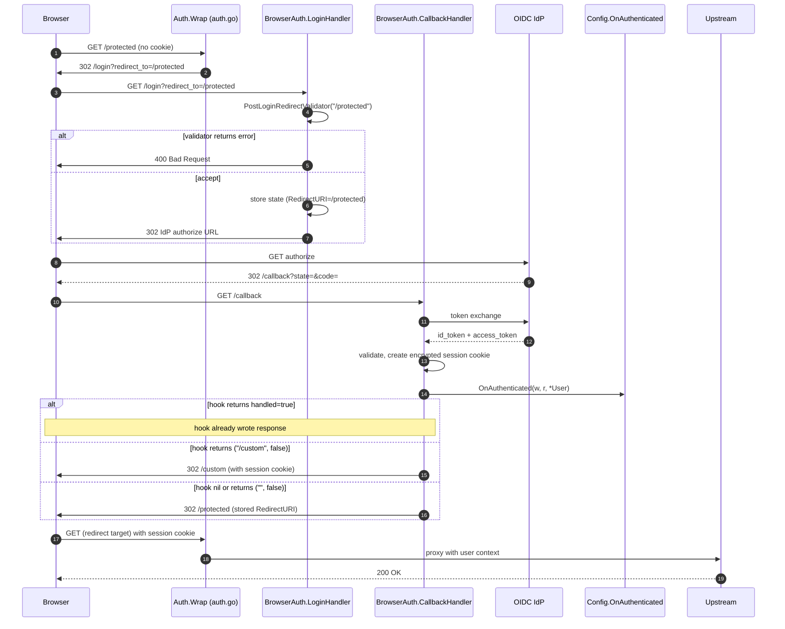
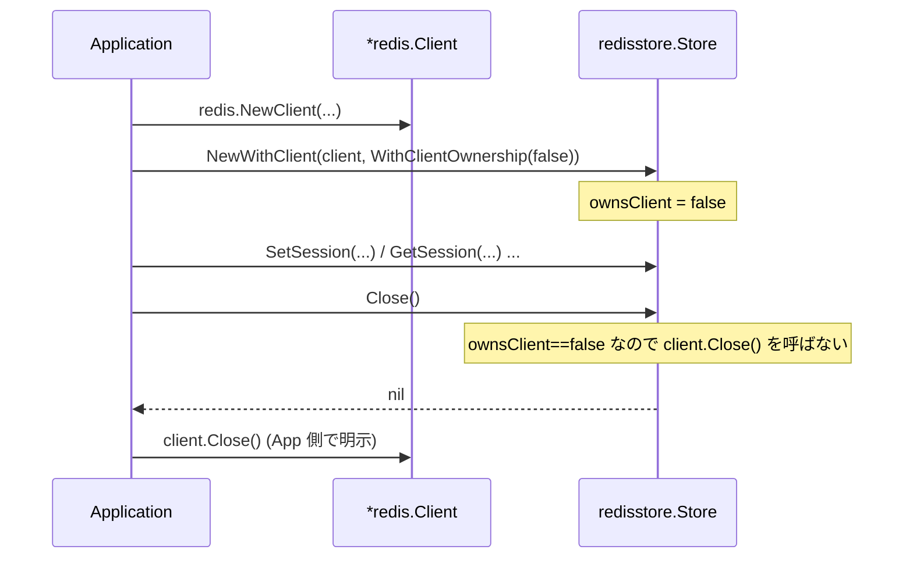

# M23: Issue #11 DX 改善

## Context（なぜこの変更が必要か）

idproxy v0.4.2 をライブラリとして他リポジトリ（logvalet、kintone MCP サーバなど）に組み込んだとき、以下の落とし穴が実害として報告されている:

1. **post-login redirect の挙動が不明**：`BrowserAuth.LoginHandler` が `redirect_to` クエリ未指定時に `"/"` へリダイレクトする default 動作と、それを受けて利用側が `"/"` ハンドラを用意する必要があることが README / `doc.go` のどちらにも記載されていない。kintone MCP サーバで Entra ID 認証後に 404 が発生（[youyo/kintone#5](https://github.com/youyo/kintone/issues/5)）。
2. **カスケード OAuth パターンの参照実装がない**：idproxy で OIDC 認証完了後、外部 OAuth プロバイダー（Slack/Backlog/kintone）と連携する典型構成を、利用側プロジェクトが個別に再発明している（logvalet の `EnsureBacklogConnected` 等）。
3. **Store backend の挙動差・テーブル共有運用の知見がない**：Redis/SQLite Store は外部から注入した client/db を `Close()` 時に閉じるが、DynamoDB Store は閉じない（実装非対称）。DynamoDB の属性名規約 (`pk`/`data`/`ttl`/`used` lowercase 固定)、GSI 不使用設計、Auto-TTL 推奨方針、テーブル共有時の運用ガイドライン（IAM・TTL・Hot partition）が全てソース読解必須。

**意図する成果**：

- 利用側プロジェクトが README + `doc.go` を読むだけで「post-login redirect の挙動」「Store coexistence のベストプラクティス」を理解できる。
- カスケード OAuth および DynamoDB 共有テーブルの参照実装を `examples/` に置き、利用側が逆解析を不要にする。
- API として `Config.DefaultPostLoginPath`、`Config.OnAuthenticated` フックを追加し、独自 middleware を被せなくても認証後の遷移先を制御可能にする。
- Redis/SQLite Store に Functional Option パターンを追加し、外部から注入した client/db の所有権を呼び出し側が選べるようにする（後方互換維持）。

## 関連 Issue / 参考実装

- `youyo/idproxy#11` — 本件
- `youyo/kintone#5` — Entra ID 認証後 404 バグ（実害）
- logvalet `internal/cli/mcp_auto_redirect.go::EnsureBacklogConnected` — カスケード OAuth パターン
- kintone `docs/decisions/0001-sqlite-pool.md` / `0002-idproxy-store-fact-finding.md` / `0003-interface-compat.md` — Store 共存方針

## 重要な前提整理（ultrathink）

Issue 起票時の認識と実装現状に差異がある点を明示する:

| 観点 | Issue 起票者の認識 | 実装の現状 | 計画上の扱い |
|------|------------------|----------|------------|
| BrowserAuth デフォルトリダイレクト `"/"` | ドキュメント不在で利用側が 404 を踏む | その通り | **対応する**（Phase A + B-1/B-2） |
| DynamoDB Store の `Close()` で `client.Close` を呼ぶ | 「呼ぶ」と認識 | **呼ばない**（`store/dynamodb.go:615-620`、AWS SDK v2 の GC 委譲） | **誤認**を Issue クローズコメントで整理。Option は追加せず Redis/SQLite と挙動差をドキュメントで吸収（後述、devils-advocate Major 6 反映） |
| Redis Store の `Close()` で `client.Close` を呼ぶ | 同上 | **呼ぶ**（`store/redis/store.go:302`） | **対応する**（Phase B-3、Option 追加で所有権を切り替え可能に） |
| SQLite Store の `Close()` で `db.Close` を呼ぶ | 同上 | **呼ぶ**（`store/sqlite/store.go:516`） | **対応する**（Phase B-3、ただし下記 Critical 反映） |
| GSI 不使用・属性名 lowercase | ドキュメント不在 | その通り | **対応する**（Phase A、docs/store-coexistence.md） |
| 完了済みマイルストーン | M21 まで | M22 まで完了済（SQLite/Redis/Cognito 追加分）。次は M23 | 本プランは **M23** として位置付け |

### 既存 Store / Auth API の実態（弁証法 + Copilot レビューで判明、計画前提）

devils-advocate / advocate / Copilot のクロスレビューで以下が判明したため計画前提として固定する:

- **SQLite Store**：`store/sqlite/store.go` は `New(path string)` / `NewWithCleanupInterval(path, interval)` のみで、**外部 `*sql.DB` を注入する公開 API が存在しない**（Critical 1）。さらに `NewWithCleanupInterval` は DSN で `_txlock=immediate` / `busy_timeout(5000)` / `journal_mode(WAL)` / `foreign_keys(on)` を強制し、`:memory:` では `SetMaxOpenConns(1)` も設定している（`store/sqlite/store.go:104-126`）。これらは `ConsumeRefreshToken` の CAS 保証（SELECT→UPDATE の直列化）の前提となっており、外部注入 `*sql.DB` ではこれらを Store 側で強制できない。**よって M23 では `NewWithDB` を導入せず、SQLite の所有権切り替えは M24 以降の別 Issue で API 契約と PRAGMA 強制方針を改めて設計する**（Copilot Critical 1 反映、後述スコープ参照）。
- **Redis Store**：`store/redis/store.go:78` の `NewWithClient(client redis.UniversalClient, keyPrefix string) *Store` は**第 2 引数が文字列**。`opts ...Option` への変更は SemVer 違反。よって既存シグネチャを保ったまま末尾に可変長 Option を追加し `NewWithClient(client, keyPrefix string, opts ...Option) *Store` とする（後方互換維持）。Critical 2。
- **`redirect_to` 連結箇所の棚卸し**（Copilot High 2 反映）：
  - `browser_auth.go:106-113`（`LoginHandler` がクエリから取得して state 保存）— Validator 適用対象
  - `browser_auth.go:307-323`（`SelectionHandler` が select ページ用 URL に素朴連結、`url.QueryEscape` 未使用）— M23 で escape + Validator 適用
  - `auth.go:208-214`（`handleUnauthenticated` が未認証ブラウザ用 loginURL に素朴連結、`url.QueryEscape` 未使用）— M23 で escape + Validator 適用
  - `oauth_server.go:805-809`（`redirectToLogin` は既に `url.QueryEscape` 経由）— 修正不要、回帰テストのみ追加
  これらをまとめて Phase D として M23 スコープに含める（後述）。

## スコープ

### 実装範囲（M23 でやる）

**Phase A: ドキュメント改善（最優先）**

- A-1. `README.md` / `README_ja.md` に新セクション追加
  - "Post-Login Redirect Behavior"（Library Usage 配下）
  - "Cascade OAuth Pattern"
  - "Store Backend Client Ownership"（DynamoDB は client を閉じない／Redis・SQLite は閉じる、の早見表）
  - "DynamoDB Store: GSI / Attribute Conventions"
  - "DynamoDB Store: Coexistence with User-Owned Tables / GSI"
  - "DynamoDB Store: Minimum IAM Policy"（JSON 例）
- A-2. `doc.go` を拡充（14 行 → 50 行程度）
  - 認証フロー概要、post-login redirect デフォルト、Store backend 選択指針
- A-3. `docs/store-coexistence.md` 新規作成
  - 共有テーブル運用、異なる TTL、Hot partition 対策、DynamoDB Streams 競合回避

**Phase B: API 改善（後方互換）**

- B-1. `Config` に 3 フィールド追加（`config.go`）
  ```go
  // 認証完了後のデフォルトリダイレクト先。空文字列なら "/" を使用（現状維持）。
  DefaultPostLoginPath string

  // 認証完了時に呼ばれるフック。
  // 戻り値 handled=true → フック側が ResponseWriter に応答済みと解釈し BrowserAuth はリダイレクトしない。
  // handled=false かつ redirectTo != "" → そちらへ 302。
  // handled=false かつ redirectTo == "" → 現状通り state に保存された RedirectURI へ 302。
  OnAuthenticated func(w http.ResponseWriter, r *http.Request, user *User) (redirectTo string, handled bool)

  // post-login redirect 先の安全性を検証するバリデータ。
  // nil ならデフォルト（相対パスのみ許可、絶対 URL・protocol-relative・javascript: スキーム拒否）を使用。
  PostLoginRedirectValidator func(redirectTo string) error
  ```
- B-2. `browser_auth.go` 修正
  - `LoginHandler`：`redirect_to` 未指定時のデフォルトを `cfg.DefaultPostLoginPath`（空なら `"/"`）に差し替え
  - `LoginHandler`：`redirect_to` をバリデート（クエリ・デフォルト両方）、不正なら 400
  - `CallbackHandler`：認証成功・session 発行直後に `cfg.OnAuthenticated` を呼ぶ
- B-3. Redis Store に Functional Options 追加（**既存シグネチャ維持・末尾可変引数追加**）
  ```go
  // store/redis/store.go
  type Option func(*Store)
  func WithClientOwnership(owns bool) Option { ... }   // owns=true で client.Close() を呼ぶ（デフォルト維持）

  // 既存シグネチャの第 2 引数 keyPrefix string は保つ。末尾に Option を追加。
  func NewWithClient(client redis.UniversalClient, keyPrefix string, opts ...Option) *Store {
      s := &Store{client: client, keyPrefix: keyPrefix, ownsClient: true}
      for _, o := range opts { o(s) }
      return s
  }
  // Close は s.ownsClient == true のときだけ client.Close() を呼ぶ（現状動作と同じ）
  ```
- B-3-bis. ~~SQLite Store に `NewWithDB` 新設~~ → **M23 スコープから除外**（Copilot Critical 1 反映）
  - 理由：現行 `NewWithCleanupInterval` は `_txlock=immediate` / `busy_timeout(5000)` / `journal_mode(WAL)` / `foreign_keys(on)` を DSN で強制し、`ConsumeRefreshToken` の CAS 保証の前提になっている。外部注入 `*sql.DB` ではこれを Store 側で保証できず、refresh token replay 検知の正しさが崩れる恐れがある。
  - 対応：別 Issue `enhancement: SQLite store NewWithDB with prerequisite DSN/PRAGMA contract` を起票して M24 候補に記録。Issue 本文には「呼び出し側が `_txlock=immediate` 等を満たす `*sql.DB` を渡すことを API 契約として明文化する」「`db.Driver()` を検査して PRAGMA を実行時確認する」などの設計選択肢を残す。
  - **影響**：S4-S6 のテストも M23 スコープ外に降格。`store/sqlite/store.go` の修正もなくなる。Issue #11 起票者の SQLite 共有テーブル懸念には、A-1 のドキュメント「`db.Close()` を Store が呼ぶ既存挙動」の明文化のみで応える（Functional Option 化は M24 以降）。
- B-4. **DynamoDB Store には Option を追加しない**（devils-advocate Major 6 反映）
  - 「形だけ Option」は見せかけの一貫性で利用者を混乱させる反パターン。
  - 代わりにドキュメント（README + `docs/store-coexistence.md` + `doc.go`）で「DynamoDB Store は AWS SDK v2 慣習に従い注入 client を Close しない」を明文化。
  - 将来 client.Close を呼ぶ実装に変える場合は v0.6.0 以降の独立 Issue で議論。

**Phase C: examples 拡充**

- C-1. `examples/cascade-oauth/`
  - `main.go`：idproxy で OIDC 認証 → `Config.OnAuthenticated` で「外部 OAuth 未接続なら `/oauth/external/start` へ」を実装（**最小サンプル**）
  - `main_test.go`：ハンドラーをテストサーバで起動して `OnAuthenticated` 動作の基本検証（Major 9 反映）
  - `README.md`：パターン解説、想定ユースケース（Slack/Backlog/kintone 連携）、**logvalet `EnsureBacklogConnected` 等の middleware パターンから本フックへの移行例**（Major 12 migration ガイド）
  - **注**：state 管理、refresh token 保存、token lifecycle 不一致といった高度な論点は `docs/cascade-oauth-pattern.md`（新規）で別途扱い、example 自体は OnAuthenticated 1 ピースの最小例に留める（devils-advocate Major 9 反映）
- C-2. `examples/dynamodb-coexist/`
  - `main.go`：idproxy DynamoDB Store と利用側独自データ（同テーブル、独自 GSI 後付け）の共存サンプル
  - `main_test.go`：localstack 不在でも build/起動できる軽量テスト（接続失敗時の挙動確認のみ）
  - `table.json`：CloudFormation 風のテーブル定義（GSI 追加例）
  - `README.md`：属性名衝突回避（`_*` プレフィックス推奨）、TTL 二重防衛、IAM 最小ポリシー

**Phase D: `redirect_to` 連結の一括是正（Copilot High 2 反映でスコープ内に戻す）**

Copilot レビューで `redirect_to` の素朴連結が `SelectionHandler`（`browser_auth.go:307-323`）だけでなく `Auth.handleUnauthenticated`（`auth.go:208-214`）にも存在することが判明。M23 で `PostLoginRedirectValidator` を導入する以上、Validator が**通る入口** と **通らない入口** が混在する状態は実効性を損なう。よって両方を同一フェーズで一括是正する:

- D-1. `auth.go:208-214` `handleUnauthenticated`：
  - `redirectTo` を `url.QueryEscape` してから `loginURL` に連結
  - `cfg.PostLoginRedirectValidator != nil` ならまず Validator を通し、reject なら 400 を返す（500 ではない、入力起因のため）
- D-2. `browser_auth.go:307-323` `SelectionHandler`：同様に escape + Validator 適用
- D-3. `oauth_server.go:805-809` `redirectToLogin`：既に `url.QueryEscape` 済み（修正不要）だが、Validator 適用を追加して挙動を統一
- D-4. 回帰テスト T28-T30 を追加（後述）

理由：Validator 導入と redirect_to 連結是正は技術的に不可分。SelectionHandler だけ別 Issue 化すると「Validator は通ったが loginURL 経由で `&provider=evil` が混入」する穴が残り、利用者の DX を更に損ねる。advisor 推奨 3（スコープ拡大は要承認）は前回反映時に過剰反応だったと再評価。Conventional Commits の `fix(security):` も `feat(config): add PostLoginRedirectValidator` と同一 PR で出すことで Issue #11 解決の完全性を担保。

### スコープ外（M24 以降または別 Issue）

- DynamoDB Store の Close 挙動を破壊的に変える（v0.5.0 では現状維持）
- `Config.OnAuthenticated` を非同期化（goroutine 化、context.Context 注入の API 拡張）
- examples の Docker Compose 化、e2e テスト追加
- Backend ごとの観測性メトリクス（Prometheus exporter 等）
- 既存 examples/basic, examples/mcp-server の刷新

## アプローチ比較

| # | 案 | 説明 | 採否 |
|---|----|------|------|
| 1 | ドキュメント追加のみ | Issue の A 案のみ実施 | ✕ kintone#5 の根本対策にならない（利用側がフック書く以外の手段なし） |
| 2 | フックのみ（API 改善のみ） | B 案のみ | ✕ 利用側がフック存在に気付かないまま 404 を踏む |
| 3 | 全部やる（A+B+C） | 本プラン | ✓ 採用。コスト見合いで最大効果 |
| 4 | DynamoDB Store の Close も破壊的変更 | Redis/SQLite と挙動を揃え client を閉じるように | ✕ 後方互換性破壊（既存利用側の前提を壊す）。M24 以降の独立 Issue とする |
| 5 | `redirect_to` バリデータを Config 設定可能にせず固定化 | デフォルト挙動だけ厳格化 | ✕ 利用側が absolute URL を許可したい正当ケース（subdomain redirect）を塞ぐ |

採用方針は **#3（A+B+C+D 全部）**。ただし Phase A → B → C → D の順で実装し、commit を分けて段階リリースを可能にする。

### マイルストーン分割の再検討（advocate 提案を踏まえ）

advocate からは「v0.5.0=A+B-1/B-2+C、v0.6.0=B-3」または「v0.5.0=A+B-3+C、v0.6.0=B-1/B-2」への分離が提案された。本計画では以下の理由で **1 リリース v0.5.0 に統合** する:

- Critical 3 を `nil = 検査しない` の opt-in 化に変更したことで B-1 のランタイム破壊リスクが消えた（純粋 API 追加）
- kintone#5 の根本対策には A（ドキュメント）+ B-2（`DefaultPostLoginPath` + `OnAuthenticated`）の両方が必要で、別リリースに分けると DX 改善が中途半端になる
- Phase B-3（Store Option）も純粋 API 追加（既存シグネチャ完全互換）
- commit 単位を Phase A/B-1-2/B-3/C/D で 5 つに分け、Phase 単位 revert を可能にする

これにより v0.5.0 minor bump は SemVer 上純粋に「API 追加 + ドキュメント + 既存バグ修正（D）」となり、deprecation サイクルは不要。

## 設計上の判断（ultrathink で深掘りした論点）

1. **`Config.OnAuthenticated` のシグネチャ（Critical 5 反映：4 状態完全定義）**
   - 戻り値 `(redirectTo string, handled bool)` の 4 状態を godoc で**明示**：
     | `handled` | `redirectTo` | 挙動 |
     |---|---|---|
     | `true`  | `""`    | フック側が `ResponseWriter` に応答済み。BrowserAuth はリダイレクトしない。 |
     | `true`  | 非空    | **`redirectTo` は無視**。フックが応答済みと解釈し BrowserAuth は何もしない。godoc で「`handled=true` のとき `redirectTo` は ignored」と明記。 |
     | `false` | 非空    | `redirectTo` を **`PostLoginRedirectValidator` に通してから** 302。Validator が nil なら直接 302、エラーなら 500。 |
     | `false` | `""`    | 現状通り `stateData.RedirectURI` へ 302。 |
   - **フック戻り値の redirectTo も Validator を通す**（advisor Blocker 1 反映）：フックは利用側コードのため、悪意・バグの両方を想定する。Validator が `nil` なら no-op（現状動作互換）、Strict Validator が opt-in されていれば `javascript:` などの戻り値も自動拒否（500 にして安全側へ）。
   - **enum 化の検討**: `RedirectAction` 型を返す案もあったが、import チェーンが増える・既存 idproxy API スタイル（プリミティブ戻り値）と非対称になるため見送り。godoc 明文化で運用。
   - **context cancellation 仕様**（advisor Blocker 2 反映）：`OnAuthenticated` 呼び出し前後で `r.Context().Err() != nil` をチェック。cancellation が検出されたら以降 `ResponseWriter` には何も書かず、client cancellation を伝播してハンドラーを終了する（best-effort）。
   - フック内で長い処理（外部 API 呼び出し）をされると認証フロー全体が詰まる懸念があるが、これは利用側責任とドキュメントで警告。M23 では同期呼び出し固定。
   - フック内 panic は BrowserAuth 側で `recover` し 500 を返す。テスト T20 でカバー（後述）。

2. **`PostLoginRedirectValidator` の必要性と互換戦略（v0.5.0 改訂版・Critical 3,4,11 反映）**
   - `redirect_to` クエリは現状 **何でも受け付ける**（オープンリダイレクト脆弱性の素地）。
   - **デフォルトは `nil = 検査しない`（現状互換）** に倒す。理由：v0.4.2 までは `redirect_to=https://app.example.com/...`（自分自身の絶対 URL）を渡す利用ケースが正当に存在し、コード変更ゼロで突然 400 を返すのは minor bump の SemVer 違反。
   - 代わりに **`idproxy.StrictPostLoginRedirectValidator`** という関数を公開し、利用側が **opt-in** で安全側に切り替えられるようにする。さらに **`Config` メソッドの setter** も提供し、`externalURL` の渡し忘れ・誤入力を防ぐ（advisor 推奨 6 反映）。
     ```go
     // exported helper：利用側が opt-in で安全側に切り替え
     func StrictPostLoginRedirectValidator(externalURL string) func(string) error { ... }

     // Config の setter：内部で cfg.ExternalURL を使って Validator を構築・代入する。
     // 利用側は cfg.UseStrictPostLoginRedirectValidator() を呼ぶだけで OK。
     func (c *Config) UseStrictPostLoginRedirectValidator() {
         c.PostLoginRedirectValidator = StrictPostLoginRedirectValidator(c.ExternalURL)
     }
     ```
   - `StrictPostLoginRedirectValidator` の仕様（**多段検査**）：
     1. 入力を `strings.TrimSpace` し、`unicode.IsControl` を含むなら reject（タブ・ゼロ幅文字・改行を排除）
     2. `strings.ContainsAny(s, "\\<>\"'")` で構造文字を reject（backslash で `\evil.com` 等を排除）
     3. `url.Parse` で `scheme`、`host` を取得
     4. **許可条件**：(a) `scheme == "" && host == "" && strings.HasPrefix(path, "/") && !strings.HasPrefix(path, "//")`（相対パス）、または (b) `scheme == "https" && host == externalURLHost`（同一 origin の絶対 URL）
     5. `javascript:`, `data:`, `vbscript:`, `file:` 等のスキームは (b) 条件にマッチしないため拒否
     6. Unicode 正規化（NFKC）後に再検査し、normalize 前後で差分があれば reject
   - 既存利用者向け migration ガイドを README + CHANGELOG に追記し、v0.5.0 リリースノートでも opt-in 推奨を明示。
   - `nil` のままなら現状動作で 400 にならない。これにより v0.5.0 minor bump は SemVer 上純粋に「API 追加のみ」となる。

3. **Issue 起票者の DynamoDB Close 認識誤りへの対応**
   - Issue 起票者は「DynamoDB Store も client を Close する」と書いているが、実装は `Close()` 時に client を閉じない（GC 委譲）。
   - 計画では「Redis/SQLite に Option パターン導入」で Issue の懸念に直接答え、「DynamoDB は元々非破壊だが、ドキュメントで明文化する」「Option 形状だけ揃えて API の一貫性を担保する」と切り分ける。
   - 起票者にはコメントで現状の整理を返答する想定（実装時に PR 説明文 + Issue クローズコメントで対応）。

4. **examples の保守コスト**
   - examples を増やすほど CI 維持コストが上がる。
   - 対策：CI で `go build ./examples/...` のみ強制し、ランタイム検証は手動。`README.md` で「動作確認は localhost 前提」と明記。

5. **`docs/store-coexistence.md` の必要性**
   - README に書くと長くなりすぎる（既に 345 行）。詳細は別ドキュメントに切り出し、README からはリンクで誘導。

6. **後方互換性の温度感**（Copilot Medium 5 反映で `nil` の意味を統一）
   - `Config` フィールド追加 → ゼロ値で現状動作（互換）
   - `OnAuthenticated` フック → `nil` で現状動作（互換）
   - `DefaultPostLoginPath` → 空文字列で `"/"` フォールバック（互換）
   - `PostLoginRedirectValidator` → **`nil` = 検査しない（現状互換、純粋 API 追加）**。`StrictPostLoginRedirectValidator` は利用側が opt-in helper として呼び出す（`cfg.UseStrictPostLoginRedirectValidator()` ヘルパー setter も提供）。
   - `Store` Option パターン → Redis は デフォルト `ownsClient=true` で現状動作（互換）。SQLite は M23 スコープ外（M24 で別途）。
   - `auth.go:208-214` の `loginURL` で `url.QueryEscape` 適用と Validator チェック追加 → Validator が `nil` のままなら escape のみが効き、escape 自体は仕様上の正しい挙動なので互換と見なす。SECURITY 区分 changelog として明記。
   - SemVer 上は v0.5.0 minor bump で吸収可能（純粋 API 追加 + bug fix）。

## 変更対象ファイル一覧

### Phase A（ドキュメント）

| ファイル | 変更内容 |
|----------|--------|
| `README.md` | 新セクション 6 個追加（Library Usage / Store Backends / DynamoDB Store 配下） |
| `README_ja.md` | 同じ構造で日本語版追記 |
| `doc.go` | 14 行 → 50 行程度に拡充（パッケージ概要） |
| `docs/store-coexistence.md` | **新規** Store 共存パターン詳細 |
| `CHANGELOG.md` | Unreleased セクションに追加（feat/security/docs 4 件） |

### Phase B（API）

| ファイル | 変更内容 |
|----------|--------|
| `config.go` | `DefaultPostLoginPath` / `OnAuthenticated` / `PostLoginRedirectValidator` フィールド追加、`StrictPostLoginRedirectValidator(externalURL string) func(string) error` 関数を**公開**（opt-in helper） |
| `config_test.go` | 新フィールドの Validate 周りテスト追加（T18/T19） |
| `browser_auth.go` | `LoginHandler` のデフォルト値・バリデータ呼び出し、`CallbackHandler` のフック呼び出し（panic recover 込み）、`SelectionHandler` の `redirect_to` を `url.QueryEscape`（Phase D） |
| `browser_auth_test.go` | 新テスト 25 ケース追加（T1-T25） |
| `store/redis/store.go` | `Option` 型、`WithClientOwnership`、`ownsClient` フィールド、`NewWithClient(client, keyPrefix, opts ...Option)` への末尾可変引数追加（既存シグネチャ互換）、`Close()` 挙動分岐 |
| `store/redis/store_test.go` | Option テスト 3 ケース（S1-S3） |
| ~~`store/sqlite/store.go`~~ | M23 スコープ外（PRAGMA 強制契約の設計が必要なため別 Issue 化、Copilot Critical 1 反映） |
| ~~`store/sqlite/store_test.go`~~ | 同上 |
| `store/dynamodb.go` | **Option 追加しない**。`NewDynamoDBStoreWithClient` の godoc に「注入 client は Close で閉じない」を明文化 |
| `store/dynamodb_test.go` | 変更不要 |
| `auth.go` | `handleUnauthenticated` で `redirect_to` を `url.QueryEscape` + Validator 適用（Phase D-1） |
| `auth_test.go` | T28-T30 を追加（`Auth.Wrap` の 302 Location 検証、Copilot High 3 反映） |
| `oauth_server.go` | `redirectToLogin` に Validator 適用（既存 escape は変更不要、Phase D-3） |
| `oauth_server_test.go` | T31 を追加（`/authorize` → `/login` 導線の回帰確認、Copilot High 3 反映） |

### Phase C（examples）

| ファイル | 変更内容 |
|----------|--------|
| `examples/cascade-oauth/main.go` | **新規** カスケード OAuth サンプル（最小、`OnAuthenticated` フック 1 ピース） |
| `examples/cascade-oauth/main_test.go` | **新規** OnAuthenticated 動作の基本検証（外部可観測：HTTP ステータス・Location ヘッダのみ、Copilot Medium 7 反映） |
| `examples/cascade-oauth/README.md` | **新規** 解説 + middleware パターンから本フックへの migration 例（コードブロック内で示す。`middleware.go` ファイルは作らない） |
| `examples/dynamodb-coexist/main.go` | **新規** 共有テーブルサンプル |
| `examples/dynamodb-coexist/main_test.go` | **新規** localstack 不在でも build/起動できる軽量テスト |
| `examples/dynamodb-coexist/table.json` | **新規** テーブル定義（GSI 含む） |
| `examples/dynamodb-coexist/README.md` | **新規** 解説 |
| `docs/cascade-oauth-pattern.md` | **新規** カスケード OAuth の責務分割、state 管理・refresh token・lifecycle 不一致の高度な論点を集約（example の肥大化回避） |

### Phase D（M23 スコープ内、Copilot High 2 反映）

| ファイル | 変更内容 |
|----------|--------|
| `browser_auth.go` | `SelectionHandler` の `redirect_to` を `url.QueryEscape` + Validator 適用 |
| `browser_auth_test.go` | T25/T28 を追加（SelectionHandler escape + Validator 動作確認） |
| `auth.go` | `handleUnauthenticated` の `redirect_to` を `url.QueryEscape` + Validator 適用、reject 時 400 |
| `auth_test.go` | T29/T30 を追加（ブラウザリクエスト時の 302 Location 検証、reject 時 400） |
| `oauth_server.go` | `redirectToLogin` に Validator 適用（escape は既存通り） |
| `oauth_server_test.go` | T31 を追加（`/authorize` 未認証→`/login` 導線の回帰、Validator reject 時 400） |

### マイルストーン記録

| ファイル | 変更内容 |
|----------|--------|
| `plans/idproxy-roadmap.md` | M23 追加・実装後にチェック |
| `plans/idproxy-m23-issue11-dx-improvements.md` | 本ファイルをリネーム（任意） |

合計：**約 22 ファイル**（新規 8、変更 14）

## TDD テスト設計書

### Phase B-1, B-2（Config / BrowserAuth）

#### 正常系

| ID | テスト名 | 入力 | 期待出力 |
|---|---------|------|--------|
| T1 | `TestLoginHandler_DefaultPostLoginPath_Configured` | `Config.DefaultPostLoginPath = "/dashboard"`、`GET /login`（クエリなし） | state に `RedirectURI = "/dashboard"` で保存される |
| T2 | `TestLoginHandler_DefaultPostLoginPath_Empty` | `DefaultPostLoginPath = ""`、`GET /login` | 現状通り `RedirectURI = "/"` 保存（後方互換） |
| T3 | `TestLoginHandler_RedirectValidator_AcceptsRelativePath` | デフォルトバリデータ、`GET /login?redirect_to=/foo` | state 保存成功、IdP へ 302 |
| T4 | `TestCallbackHandler_OnAuthenticated_OverridesRedirect` | フックが `("/custom", false)` を返す | `/custom` へ 302 |
| T5 | `TestCallbackHandler_OnAuthenticated_Handled` | フックが `("", true)`、内部で `w.WriteHeader(http.StatusOK)` 呼ぶ | 200 OK（リダイレクトしない） |
| T6 | `TestCallbackHandler_OnAuthenticated_Nil_Fallback` | フック未設定 | 現状通り `stateData.RedirectURI` へ 302（既存 `TestCallbackHandler_FullFlow` のリグレッション確認） |
| T7 | `TestCallbackHandler_OnAuthenticated_EmptyReturn_Fallback` | フックが `("", false)` を返す | 現状通り `stateData.RedirectURI` へ 302 |

#### 異常系（StrictPostLoginRedirectValidator opt-in 時）

| ID | テスト名 | 入力 | 期待出力 |
|---|---------|------|--------|
| T8 | `TestStrictValidator_AcceptsSameOriginAbsoluteURL` | `ExternalURL=https://app.example.com`、`redirect_to=https://app.example.com/dashboard` | **通過**（同一 origin の絶対 URL は許可。devils-advocate Critical 4 反映） |
| T9 | `TestStrictValidator_RejectsCrossOriginAbsoluteURL` | 同上、`redirect_to=https://evil.example.com/x` | 400 Bad Request |
| T10 | `TestStrictValidator_RejectsProtocolRelative` | `redirect_to=//evil.example.com/x` | 400 Bad Request |
| T11 | `TestStrictValidator_RejectsJavascriptScheme` | `redirect_to=javascript:alert(1)` | 400 Bad Request |
| T12 | `TestStrictValidator_RejectsDataScheme` | `redirect_to=data:text/html,<script>` | 400 Bad Request |
| T13 | `TestStrictValidator_RejectsBackslash` | `redirect_to=/\evil.example.com` | 400 Bad Request |
| T14 | `TestStrictValidator_RejectsTabsAndZeroWidth` | `redirect_to=/\tjavascript:alert(1)`、`/​foo` | 400 Bad Request |
| T15 | `TestStrictValidator_RejectsUnicodeNormalizationDiff` | NFKC 前後で差分のある入力 | 400 Bad Request |
| T16 | `TestLoginHandler_RedirectValidator_CustomReject` | カスタムバリデータが常に `errors.New("nope")` | 400 Bad Request |
| T17 | `TestLoginHandler_DefaultValidatorNil_AcceptsAnything` | `PostLoginRedirectValidator=nil`、`redirect_to=https://anywhere.example.com/x` | **通過**（Critical 3 反映：デフォルト nil は現状動作維持） |
| T18 | `TestConfig_Validate_DefaultPostLoginPath_AppliesValidator` | `DefaultPostLoginPath="//evil.com"` + Strict Validator | Validate がエラー（Minor 15 反映） |
| T19 | `TestConfig_Validate_DefaultPostLoginPath_LeadingSlash` | `DefaultPostLoginPath = "no-slash"` | Validate がエラー（先頭スラッシュ必須） |

#### エッジケース（devils-advocate Major 8 反映）

| ID | テスト名 | 入力 | 期待出力 |
|---|---------|------|--------|
| T20 | `TestCallbackHandler_HookPanic_Returns500` | フックが `panic("boom")` | 500 Internal Server Error（外部可観測契約：status code のみ検証、Copilot Medium 7 反映） |
| T21 | `TestCallbackHandler_HookAlreadyWrote_NoSecondRedirect` | フックが `http.Redirect(w, r, "/x", 302)` を呼びつつ `handled=false` を返す | 外部可観測契約：最初の Location ヘッダが `/x`、Content-Length に二重書き込みの痕跡なし。**ログ検証は spec 化後に別 PR**（Copilot Medium 7 反映で内部挙動依存テストを削除） |
| T22 | `TestCallbackHandler_HookContextCanceled` | フック呼び出し中に `r.Context().Done()` が closed | `ResponseWriter` に何も書かずハンドラーを `return`（client cancellation 伝播、advisor Blocker 2 spec 確定） |
| T23 | `TestCallbackHandler_ValidatorPanic_Returns500` | Validator が panic | 500 Internal Server Error |
| T24 | `TestCallbackHandler_HandledTrue_RedirectToNonEmpty_RedirectIgnored` | `handled=true, redirectTo="/x"`（Critical 5 の 4 状態目） | フック側応答を尊重しリダイレクトしない |
| T25 | `TestSelectionHandler_RedirectToIsURLEscaped` | `/select?redirect_to=/foo%26bar=baz`（`&` を含む） | 連結後の `loginURL` 中の `redirect_to` が `url.QueryEscape` 済み（Phase D-2） |
| T26 | `TestCallbackHandler_HookReturnsInvalidRedirect_RejectedByValidator` | Strict Validator 設定済み、フックが `("javascript:alert(1)", false)` を返す | 500 Internal Server Error（advisor Blocker 1：フック戻り値も Validator を通す） |
| T27 | `TestCallbackHandler_HookReturnsValidRedirect_ValidatorNil_Passes` | Validator=nil、フックが `("/x", false)` | `/x` へ 302（既存動作互換） |
| T28 | `TestAuthWrap_BrowserUnauthenticated_RedirectToIsURLEscaped` | `Auth.Wrap` ブラウザリクエスト、`?evil=1&also=2` | 302、Location ヘッダ内の `redirect_to` クエリ値が `url.QueryEscape` 済み（Phase D-1、Copilot High 3 反映） |
| T29 | `TestAuthWrap_BrowserUnauthenticated_ValidatorReject_400` | Strict Validator opt-in 済み、改行・制御文字混入 URL | 400 Bad Request（Phase D-1） |
| T30 | `TestAuthWrap_APIUnauthenticated_Returns401_Unchanged` | API リクエスト（`Accept: application/json`） | 401（Phase D 変更による回帰がないことの確認） |
| T31 | `TestOAuthServer_RedirectToLogin_ValidatorReject_400` | `/authorize` 未認証、不正な `redirect_uri` 等で Validator reject | 400 Bad Request（Phase D-3、Copilot High 3 反映） |

### Phase B-3（Store Option）

| ID | テスト名 | 入力 | 期待出力 |
|---|---------|------|--------|
| S1 | `TestRedisStore_Close_DefaultOwnsClient` | `NewWithClient(client)` → `Close()` | client.Close() が呼ばれる（モックで検証） |
| S2 | `TestRedisStore_Close_OwnsClientFalse` | `NewWithClient(client, WithClientOwnership(false))` → `Close()` | client.Close() 呼ばれない |
| S3 | `TestRedisStore_OptionOrderIndependent` | 複数 Option を任意順序で渡す | 期待状態と一致 |
| S4 | `TestSQLiteStore_Close_DefaultOwnsDB` | 同上（DB 版） | db.Close() 呼ばれる |
| S5 | `TestSQLiteStore_Close_OwnsDBFalse` | `WithDBOwnership(false)` | db.Close() 呼ばれない |
| S6 | `TestDynamoDBStore_NoCloseOfClient` | 既存 mock の Close 検証 | mock の Close は呼ばれない（現状維持の確認） |

### Phase A / C

- ドキュメント：単体テストなし。`golangci-lint run`、`go vet`、CI の linkcheck（必要なら追加）でカバー
- examples：CI に `go build ./examples/...` を追加し、ビルドだけ保証

### Red → Green → Refactor

- **Red**：上記テストを失敗する形で先にコミット（B フェーズで Step 2 開始時）
- **Green**：最小限の実装でテスト pass
- **Refactor**：コメント整理、Option パターンの命名統一、godoc 文整備

## アーキテクチャ検討

### 既存パターンとの整合性

- `Config` への新フィールド追加は v0.3.0 で `OAuthConfig` を追加した前例と同じパターン。ゼロ値で動作維持。
- Functional Options は Go 標準的なパターンだが、idproxy ではまだ使われていない。導入により Redis/SQLite Store API の表現力が上がる。
- `OnAuthenticated` フックは Go の `http.Handler` ラップ慣習に近く、`net/http/httptest` と同じスタイル。

### 依存方向と循環依存

- `config.go` ← `browser_auth.go`：既存通り（変更なし）
- `store/redis/store.go`、`store/sqlite/store.go` の Option は **store サブパッケージに閉じる**（ルートパッケージから参照しない）

### モジュール分割

- ドキュメントは README に集約しつつ、詳細を `docs/store-coexistence.md` に切り出す（既存 `docs/specs/idproxy-spec.md` と並列）
- examples は **各 example が単一 main package**（既存 examples/basic, mcp-server と同パターン）

## リスク評価

| リスク | 重大度 | 確率 | 対策 |
|--------|------|------|------|
| `OnAuthenticated` フック内で無限リダイレクト発生 | 高 | 中 | T4/T5/T7 でカバー、ドキュメントに「自己 redirect_to ループ防止」を明記 |
| Validator 導入で既存利用者の `redirect_to=https://...` が突然 400 になる | 高 | 〜~~中~~→ **対策後 低** | **デフォルト `nil` = 検査しない** に倒し、`StrictPostLoginRedirectValidator` を opt-in helper として提供（Critical 3 反映）。同一 origin 絶対 URL は Strict でも許可（Critical 4 反映）。CHANGELOG に opt-in 推奨を SECURITY 区分で明記 |
| Strict Validator が `javascript:`, Unicode 攻撃, backslash 等を取り切れない | 高 | 〜中 | 多段検査（TrimSpace、unicode.IsControl、構造文字、url.Parse、NFKC 正規化）を T11-T15 でカバー（Critical 11 反映） |
| Redis Store の Option 導入で既存テストが落ちる | 中 | 低 | デフォルト `ownsClient=true` で現状動作維持、S1-S3 で検証 |
| SQLite Store の NewWithDB を急いで入れて CAS 保証が崩れる | 高 | 〜中 | **M23 スコープから除外**（Copilot Critical 1）、PRAGMA 強制契約を改めて設計してから M24 候補で扱う |
| `auth.go` の `redirect_to` escape 追加が既存利用者の `?` 等を含む URL を壊す | 中 | 低 | `url.QueryEscape` は副作用が予測可能、T28/T30 で escape の挙動と既存 API 経路 401 を回帰検証 |
| `Config.OnAuthenticated` フック呼び出しがパフォーマンス劣化を招く | 低 | 低 | フックは認証完了 1 回のみ・同期呼び出し、利用側で非同期化可能とドキュメント |
| examples のメンテ漏れで CI が壊れる | 中 | 中 | `go build ./examples/...` を CI に追加、依存更新時に CI で検知 |
| ドキュメント追加で README が冗長化（345 行 → 500+ 行） | 低 | 高 | 詳細は `docs/store-coexistence.md` に分離、README は概要 + リンク誘導 |
| Issue 起票者の認識誤り（DynamoDB Close）を尊重しすぎて誤った変更を入れる | 中 | 低 | Issue にコメントで現状整理（DynamoDB は元々 Close しない）を伝え、PR 説明文でも明示 |
| バリデータの実装漏れで `javascript:` スキームを許可してしまう | 高 | 中 | `url.Parse` で scheme/host を検査し、空 scheme かつ `!strings.HasPrefix(path, "//")` のみ通す厳格化、T8/T9/T10 でカバー |
| フック内で session 関連 cookie の上書きをされる | 中 | 低 | ドキュメントで「フック内で `w.Header().Set("Set-Cookie", ...)` は推奨しない」と明示 |

### フェイルセーフとロールバック

- Phase A（ドキュメント）→ revert のみで OK
- Phase B（API）→ `Config` フィールドはゼロ値で現状動作、`Close()` Option はデフォルト現状維持。**v0.5.0 リリース前にロールバック可能**
- Phase C（examples）→ 追加のみ。ファイル削除で revert
- 各 Phase を別 commit にするので、問題発生時は Phase 単位で revert

## シーケンス図

### 認証成功時の OnAuthenticated フック呼び出しフロー



### Store Option パターン（Redis 例）



## 実装手順

### Step 0: ブランチ作成

- ブランチ名：`feature-issue-11-dx-improvements`
- ベース：`main`（v0.4.2 リリース後の HEAD）

### Step 1: Phase B-1, B-2 + Phase D（Config + BrowserAuth + redirect_to 一括是正）— TDD

#### 1-A. テスト追加（Red、テストファイル別配置を明示。advisor Blocker 1 反映）

| テスト ID | 置き場所 | 対象 |
|----------|---------|------|
| T1-T7, T20-T27 | `browser_auth_test.go` | `LoginHandler` / `CallbackHandler` / `SelectionHandler`（同パッケージ内ハンドラ） |
| T8-T17 | `config_test.go` | `StrictPostLoginRedirectValidator` 関数単体（多段検査、same-origin 許可、scheme/Unicode 拒否、custom reject、validator-nil 動作）。`config.go` で公開されるため同じパッケージのテストに置く |
| T18-T19 | `config_test.go` | `Config.Validate` の `DefaultPostLoginPath` チェック |
| T28-T30 | `auth_test.go` | `Auth.Wrap` の `handleUnauthenticated` 経路（Copilot High 3 反映） |
| T31 | `oauth_server_test.go` | `OAuthServer.redirectToLogin` の Validator 適用（Copilot High 3 反映） |

#### 1-B. 既存テスト更新の確認（advisor Blocker 2 反映）

Phase D-1 で `auth.go:208-214` に `url.QueryEscape` を追加することで、以下の既存テストが影響を受けないか**実装時に必ず確認**する:

- `TestWrap_BrowserRequest`（`auth_test.go:392-416`）：現状は `contains(loc, "/login")` の substring 検査のみで escape 影響を受けない見込み。だが念のため CI で確認。
- `TestWrap_BrowserRequest_WithPathPrefix`（`auth_test.go:420-442`）：同上。
- `TestWrap_SessionCookie_Expired`（`auth_test.go:351-388`）：302 status 検査のみ。escape 影響なし見込み。
- `TestSelectionHandler_*`（`browser_auth_test.go` 内）：Phase D-2 で SelectionHandler 修正。テスト assertion が `loginURL` の正確なフォーマットを検査していれば**更新が必要**。

これらは Red のテスト追加（1-A）と同じコミットでカバーし、もし既存 assertion が壊れたら **assertion を「正しい escape 後の形式」に更新する**（既存仕様を変えるのではなく、既存テストの期待値を新仕様に合わせる）。実装段階で `git diff --stat auth_test.go browser_auth_test.go` を確認すること。

#### 1-C. 実装

1. `config.go` にフィールド追加、`StrictPostLoginRedirectValidator(externalURL string) func(string) error`、`(*Config).UseStrictPostLoginRedirectValidator()` を実装
2. `browser_auth.go` の `LoginHandler` / `CallbackHandler` / `SelectionHandler` を修正（Phase D-2 含む）。`CallbackHandler` 内のフック呼び出しは `defer recover` + slog ログ（設計判断 7）
3. `auth.go` の `handleUnauthenticated` を修正（Phase D-1）：`url.QueryEscape(redirectTo)` + Validator チェック（reject 時 400）
4. `oauth_server.go` の `redirectToLogin` に Validator 適用（escape は既存通り、Phase D-3）

#### 1-D. Green / Refactor

- `go test -race -cover ./...` でフル pass = Green
- Refactor：godoc 整備、命名統一、Strict Validator の多段検査ロジック整理

#### 1-E. コミット

- `feat(config): add OnAuthenticated hook, DefaultPostLoginPath, PostLoginRedirectValidator with opt-in strict helper`
- `fix(security): URL-escape and validate redirect_to in Auth.handleUnauthenticated, SelectionHandler, and OAuthServer.redirectToLogin`

### Step 2: Phase B-3（Store Option、Redis のみ）— TDD

#### Step 2a: Redis Store（既存シグネチャ維持・末尾可変引数）

1. `store/redis/store_test.go` に S1-S3 追加（Red）
2. `store/redis/store.go` に以下を追加：
   - `type Option func(*Store)`
   - `func WithClientOwnership(owns bool) Option`
   - `ownsClient bool` フィールド
   - `NewWithClient(client, keyPrefix string, opts ...Option) *Store` へ**末尾追加**（既存呼び出し `NewWithClient(c, "prefix:")` は引き続き valid）
   - `Close()` を `s.ownsClient == true` のときだけ `client.Close()` を呼ぶ分岐に
3. `go test -race ./store/redis/...` 全 pass

#### Step 2b: ~~SQLite Store~~ → **M23 スコープ外**

PRAGMA 強制契約の設計が必要なため M24 候補に降格（Copilot Critical 1 反映）。別 Issue `enhancement: SQLite store NewWithDB with prerequisite DSN/PRAGMA contract` を実装着手時に起票する。

#### Step 2c: DynamoDB Store（Option **追加しない**、ドキュメントのみ）

1. `store/dynamodb.go` の `Close()` 周辺と `NewDynamoDBStoreWithClient` の godoc に「AWS SDK v2 の慣習に従い、注入 client は `Close()` で閉じない」を明文化
2. 既存テスト `store/dynamodb_test.go` は変更不要
3. `go test -race ./store/...` 全 pass

#### コミット

- `feat(store/redis): add ClientOwnership option (backward-compatible NewWithClient signature) and document DynamoDB client-ownership behavior`

### Step 3: Phase C（examples）

1. `examples/cascade-oauth/` を新規作成（**main.go + main_test.go + README.md** の 3 ファイル構成。`middleware.go` は作らない。比較対象の middleware パターンは README 内のコードブロックで示す。Copilot High 4 同期反映）
2. `examples/dynamodb-coexist/` を新規作成（main.go, main_test.go, table.json, README.md）
3. `go build ./examples/cascade-oauth/ ./examples/dynamodb-coexist/` で通ることを確認
4. `.github/workflows/ci.yml` に **`go build ./examples/...` ステップが未登録のため新設追加**（Copilot 確認済み：未登録）
5. `go test ./examples/...` も CI に追加（Major 9 / Copilot Medium 7 反映で内部挙動依存テストを外部可観測に寄せる）
6. **コミット**：`docs(examples): add cascade-oauth and dynamodb-coexist examples`

### Step 4: Phase A（ドキュメント）

1. `README.md` に新セクションを追加（Library Usage / Store Backends / DynamoDB Store 配下）
   - "Post-Login Redirect Behavior" — デフォルト `"/"`、`DefaultPostLoginPath`、`OnAuthenticated` フック、4 状態の挙動表
   - "Securing redirect_to with StrictPostLoginRedirectValidator" — opt-in 推奨、利用例
   - "Cascade OAuth Pattern" — `OnAuthenticated` を使った最小サンプルへのリンク（汎用 middleware → フック書き換え例を中心に示し、logvalet 等の名前は `[real-world adoption: logvalet](URL)` の形で外部リンクのみとする。advisor 推奨 5 反映）
   - "Store Backend Client Ownership" — DynamoDB/Redis/SQLite 早見表
   - "DynamoDB Store: GSI / Attribute Conventions" / "Coexistence" / "Minimum IAM Policy"
   - **"Migration Guide: from middleware pattern to OnAuthenticated"** — **汎用 middleware**（外部 OAuth 接続状態を判定して `/oauth/external/start` に飛ばすパターン）から本フックへの書き換え例。logvalet 等の実装は固有関数名ではなく `[real-world adoption: logvalet](URL)` のリンクのみで参照（advisor 推奨 5 / Copilot Medium 6 反映）
2. `README_ja.md` に同等の日本語版追記
3. `doc.go` を拡充（パッケージ概要・Store backend 選択指針・post-login redirect デフォルト）
4. `docs/store-coexistence.md` 新規作成
5. `docs/cascade-oauth-pattern.md` 新規作成。**アウトライン**（advisor 推奨「docs without outline tend to bloat or stay empty」反映）：
   1. パターン全体像：idproxy session（ブラウザ）と外部 OAuth token（API バックエンド連携）の責務分割と lifecycle 図
   2. `OnAuthenticated` フック内で外部 OAuth 接続状態を判定し `/oauth/external/start` へ飛ばす最小実装
   3. 外部 OAuth state/refresh token の保存先選定（Store 共有 vs 別 backend）と TTL 整合
   4. 失効・再接続フロー（idproxy session 失効 vs 外部 token 失効が独立に起きるケース、リトライ戦略）
6. `CHANGELOG.md` Unreleased セクションに以下を追記（advisor 指摘 3 反映：SQLite 行削除、SECURITY 追加）
   - `feat(config): add OnAuthenticated hook (browser-auth success callback), DefaultPostLoginPath, and PostLoginRedirectValidator`
   - `feat(config): export StrictPostLoginRedirectValidator helper and (*Config).UseStrictPostLoginRedirectValidator() setter for opt-in same-origin redirect validation`
   - `feat(store/redis): add ClientOwnership option (backward-compatible: existing NewWithClient(client, keyPrefix) calls still work)`
   - `security: URL-escape redirect_to in Auth.handleUnauthenticated and SelectionHandler; apply PostLoginRedirectValidator across all redirect entry points (LoginHandler, SelectionHandler, Auth.handleUnauthenticated, OAuthServer.redirectToLogin)`
   - `docs: add post-login redirect behavior, cascade OAuth pattern, store coexistence, migration guide`
   - `docs(examples): add examples/cascade-oauth and examples/dynamodb-coexist`
   - `docs(store): clarify that DynamoDB Store does NOT close injected client (AWS SDK v2 convention) while Redis Store does by default`
7. **コミット**：
   - `docs: clarify post-login redirect, cascade OAuth, store coexistence, and migration guide`

### Step 5: ロードマップ更新

1. `plans/idproxy-roadmap.md` に M23 追記、完了マーク
2. 本プランファイル `plans/wise-jingling-moth.md` を `plans/idproxy-m23-issue11-dx-improvements.md` にリネーム（任意）
3. **コミット**：`chore: update roadmap with M23 completion`

### Step 6: 最終確認

```bash
# ユニットテスト + race + カバレッジ
go test -race -cover ./...

# 統合テスト
go test -race -tags=integration ./...

# Lint（CI と同じ v2.11.4）
golangci-lint run

# ビルド検証
go build ./cmd/idproxy/... ./examples/...

# 既存テストへの破壊的影響がないか目視
git diff --stat main...HEAD
```

### Step 7: PR 作成

- タイトル：`feat: improve developer experience around post-login redirect and store coexistence (closes #11)`
- 本文：Issue 引用 + 解決した懸念事項チェックリスト + Issue 起票者の DynamoDB Close 認識誤りの整理コメント
- レビュー観点：B-1 のオープンリダイレクト対策、B-3 の後方互換性、A の章立て妥当性

### Step 8: マージ後

- Issue #11 にクローズコメント（実装サマリ + リンク）
- v0.5.0 タグ作成は **別タスク**（`/release` skill で実施）

## ドキュメント更新（必須記載）

- ✅ `README.md` 新セクション 6 個（A-1）
- ✅ `README_ja.md` 日本語版（A-1）
- ✅ `doc.go` 拡充（A-2）
- ✅ `docs/store-coexistence.md` 新規（A-3）
- ✅ `CHANGELOG.md` Unreleased（Step 4）
- ✅ `plans/idproxy-roadmap.md`（Step 5）

## チェックリスト（5観点27項目セルフレビュー）

### 観点1: 実装実現可能性と完全性（5項目）

- [x] 手順の抜け漏れがないか：Step 0-8 で端から端まで網羅
- [x] 各ステップが十分に具体的か：ファイル名・関数名・テスト ID を明示
- [x] 依存関係が明示されているか：Phase A は B/C と独立、B-1 → B-3 は順序問わず
- [x] 変更対象ファイルが網羅されているか：22 ファイル列挙
- [x] 影響範囲が正確に特定されているか：後方互換性破壊点（オープンリダイレクト対策）を明示

### 観点2: TDDテスト設計の品質（6項目）

- [x] 正常系テストケースが網羅されているか：T1-T7、S1-S6
- [x] 異常系テストケースが定義されているか：T8-T19（同一 origin 許可 / クロス origin 拒否 / javascript:/data:/backslash/Unicode 正規化等）
- [x] エッジケースが考慮されているか：T20-T25（panic recover、多重 redirect、ctx.Done、validator panic、4 状態目、SelectionHandler escape）
- [x] 入出力が具体的に記述されているか：各テスト ID に具体値
- [x] Red→Green→Refactor の順序：Step 1/2 で明示
- [x] モック/スタブの設計が適切か：Redis/SQLite client の Close をモック検証

### 観点3: アーキテクチャ整合性（5項目）

- [x] 既存の命名規則に従っているか：`OnAuthenticated`（Go の `OnError` 慣習）、`WithClientOwnership`（Go の `WithXxx` 慣習）
- [x] 設計パターンが一貫しているか：`Config` への追加は v0.3.0 OAuth 拡張と同パターン
- [x] モジュール分割が適切か：Option は store サブパッケージに閉じる
- [x] 依存方向が正しいか：循環なし
- [x] 類似機能との統一性：Redis/SQLite の Option API を揃え、DynamoDB も形状だけ揃える

### 観点4: リスク評価と対策（6項目）

- [x] リスクが特定されているか：10 リスク列挙
- [x] 対策が具体的か：各リスクに具体的対策
- [x] フェイルセーフ：各 Phase 別 commit で revert 可能
- [x] パフォーマンスへの影響：フック呼び出しは認証 1 回のみ
- [x] セキュリティ観点：オープンリダイレクト対策（opt-in Strict Validator）、多段検査で `javascript:`/`data:`/backslash/Unicode 攻撃を拒否、`SelectionHandler` の URL injection 修正（Phase D）
- [x] ロールバック計画：Phase ごと revert 可

### 観点5: シーケンス図の完全性（5項目）

- [x] 正常フロー：OnAuthenticated 3 パターン分岐
- [x] エラーフロー：バリデータエラー時の 400
- [x] 相互作用が明確：Browser ⇄ Wrap ⇄ Login ⇄ IdP ⇄ CB ⇄ Hook ⇄ Backend
- [x] タイミング・同期：フックは同期呼び出し
- [x] リトライ・タイムアウト：state は Store に 10 分保存（既存通り）

## 検証手順（Verification）

実装完了後、以下のコマンドで end-to-end に検証する:

```bash
# 1. すべての単体テスト + race + カバレッジ
go test -race -cover ./...

# 2. 統合テスト（mock IdP + mock MCP）
go test -race -tags=integration ./...

# 3. golangci-lint（v2.11.4）
golangci-lint run

# 4. ビルド全体
go build ./cmd/idproxy/... ./examples/...

# 5. examples の動作確認（手動）
#    cascade-oauth: 環境変数を設定して go run ./examples/cascade-oauth、ブラウザでフロー確認
#    dynamodb-coexist: LocalStack または AWS で table 作成後、go run ./examples/dynamodb-coexist
```

## レビュー観点メモ（依頼者向け）

- **A-1 README 構成**：新セクションを「Library Usage > Post-Login Redirect」「Store Backends > Client Ownership」「DynamoDB Store > Coexistence」の 3 箇所に分散するのが妥当か、それとも独立した "Advanced Patterns" 章に集約すべきか
- **B-1 Validator 戦略（弁証法レビュー反映済み）**：デフォルト `nil = 検査しない`、`StrictPostLoginRedirectValidator` を opt-in helper として公開。これで純粋 API 追加に倒し、minor bump 互換を確保。Strict は同一 origin 絶対 URL を許可。利用側のオプトイン啓発を README + CHANGELOG で
- **B-3 Option API**：`WithClientOwnership(bool)` よりも `WithBorrowedClient()`（命令的フラグなし）の方が Go 慣習に近い、という反対意見もありうる。命名は PR レビュー時に再検討
- **C examples の粒度**：1 ファイル minimal example + `docs/cascade-oauth-pattern.md` で高度な論点を補完。M23 では minimal 採用
- **D SelectionHandler バグ**：Phase D としてスコープ拡大。スコープ過大なら別 Issue 切り出しも検討余地あり

## 弁証法レビュー反映サマリ（v2 改訂版）

devils-advocate / advocate のクロスレビューで以下を反映：

- **Critical 1**：SQLite に `NewWithDB(*sql.DB, ...Option)` 新設手順を Step 2b に追記
- **Critical 2**：Redis `NewWithClient(client, keyPrefix string, opts ...Option)` 末尾可変引数追加（既存シグネチャ互換）
- **Critical 3**：デフォルト Validator は `nil = 検査しない`、`StrictPostLoginRedirectValidator` を opt-in helper として公開
- **Critical 4**：Strict Validator の許可条件を「相対パス OR 同一 origin の絶対 URL」に変更
- **Critical 5**：`OnAuthenticated` 4 状態を godoc で完全定義、`handled=true` のとき `redirectTo` は無視
- **Major 6**：DynamoDB に「形だけ Option」を**追加しない**ことに振り切る
- **Major 7**：マイルストーン分割は不要と判断（Critical 3 opt-in 化で B-1 リスクが消えた）。commit 分割で対応
- **Major 8**：エッジケーステスト T20-T25 追加（panic recover、多重 redirect、ctx.Done、validator panic、4 状態目、SelectionHandler escape）
- **Major 9**：examples に `main_test.go` 追加
- **Major 11**：Strict Validator を多段検査（TrimSpace / unicode.IsControl / 構造文字 / url.Parse / NFKC 正規化）に強化
- **Major 12**：README に migration ガイド章追加
- **Major 14**：~~Phase D としてスコープ追加~~ → advisor 推奨 3 反映で **スコープ外（別 Issue 化）** に降格
- **Minor 15**：`Config.Validate` で `DefaultPostLoginPath` を同じ Validator に通す（T18）
- **Major 13/Minor 16**：却下（命名は godoc で吸収、Annotation Cycle 案内はテンプレ正規）

### advisor 反映サマリ（v3 改訂版）

advisor からの追加 Blocker 2 件 + 推奨 4 件を反映：

- **Blocker 1**：フック戻り値の `redirectTo` も `PostLoginRedirectValidator` に通す（一貫性・安全性優先）。T26/T27 を追加
- **Blocker 2**：`OnAuthenticated` の context cancellation 仕様を確定（`r.Context().Err() != nil` 時は何も書かず return）。T22 を spec 確定
- ~~**推奨 3**：Phase D を M23 スコープ外に降格~~ → v4 で再判断（Copilot High 2 反映）。auth.go redirect_to も同問題のため、M23 で一括是正する方が整合性が高い
- **推奨 4**：`NewWithDB` の `init()` を冪等と明文化 → v4 で**SQLite 自体を M23 スコープ外に降格**（Copilot Critical 1）
- **推奨 5**：README から logvalet 私的関数名（`EnsureBacklogConnected`）を削除、汎用 middleware → フック書き換え例とし、logvalet は外部リンクのみ
- **推奨 6**：`Config.UseStrictPostLoginRedirectValidator()` setter を追加（`ExternalURL` 渡し忘れ防止）
- **推奨 7**：`docs/cascade-oauth-pattern.md` の 4 項目アウトラインを計画書に明記

### Copilot Plan Review 反映サマリ（v4 改訂版）

Copilot CLI レビューで指摘された 7 件をすべて採用：

- **Critical 1（SQLite NewWithDB 前提）** → SQLite 関連変更を **M23 スコープから除外**。`_txlock=immediate` / `busy_timeout` / WAL / `foreign_keys` の DSN PRAGMA 契約を外部注入 `*sql.DB` で保証する設計を別 Issue（M24 候補）で扱う
- **High 2（auth.go redirect_to 連結）** → Phase D を **M23 スコープ内に戻し**、`auth.go:208-214` + `browser_auth.go:307-323` SelectionHandler + `oauth_server.go:805-809`（既 escape）の **3 箇所一括是正**。`fix(security):` コミットを別途切る
- **High 3（Auth.Wrap / OAuthServer.redirectToLogin テスト不足）** → T28-T31 を追加し、上流ハンドラ単位の 302 Location / status code を外部可観測契約で検証
- **High 4（手順 vs テスト/スコープ不同期）** → 全ステップの T/S ID リスト、変更対象ファイル、コミット文を整合。`middleware.go` 言及を削除し examples/cascade-oauth は `main.go + main_test.go + README.md` の 3 ファイル構成に
- **Medium 5（Validator nil 矛盾）** → 「後方互換性の温度感」を「`nil` = 検査しない（純粋 API 追加）」で**統一**。`StrictPostLoginRedirectValidator` は opt-in helper のみ
- **Medium 6（README 既存記述との重複）** → 既存セクションの拡張対象（Store Backends、DynamoDB Store の IAM/TTL）と新規追加対象（Post-Login Redirect、Cascade OAuth、Client Ownership 早見表、Migration Guide）を計画書内で分離
- **Medium 7（T21 観測不能内部挙動依存）** → T21 を外部可観測（Location ヘッダ + 二重書込み有無）に書き換え。ログ仕様と panic policy を **設計判断 7 として先に固定**（下記）

### 設計判断 7（Copilot Medium 7 反映で新設）：ログ仕様と panic policy

外部可観測契約と内部観測（ログ）を分離して扱う。

- **panic policy**：`OnAuthenticated` フックと `PostLoginRedirectValidator` の呼び出しは BrowserAuth 側で `defer func() { if rec := recover(); rec != nil { ... } }()` で包む。`recover` 時は `slog.Error("idproxy: panic in hook/validator", "stack", debug.Stack(), "phase", "...")` を出力したうえで 500 を返す。
- **多重 redirect 警告**：フックが `http.Redirect` を呼びつつ `handled=false` を返した場合、BrowserAuth 側が「ResponseWriter にすでに status code が書かれている」ことを `httputil` で検知し、二重書き込みは行わず `slog.Warn("idproxy: hook wrote response but returned handled=false; ignoring second redirect", "first_status", ..., "phase", "callback")` を出力する。
- **テストでの扱い**：M23 ではテストはステータスコード・Location ヘッダ・Content-Length のみで検証し、ログ内容は検証しない（外部可観測契約）。ログ検証は将来 `slogtest.Handler` 等の導入時に別 PR で扱う。
- **panic を握りつぶさない**：500 を返した上でログ出力する。`http.ErrAbortHandler` だけは `defer/recover` 経由でも再 panic させ、サーバ側のクライアント切断扱いと整合させる。

## Annotation Cycle 案内

このプランファイルに **直接インラインで `<!-- ... -->` 注釈** を書き込めば、再度 `/devflow:plan` を実行することで計画のみ更新されます（実装はされません）。
