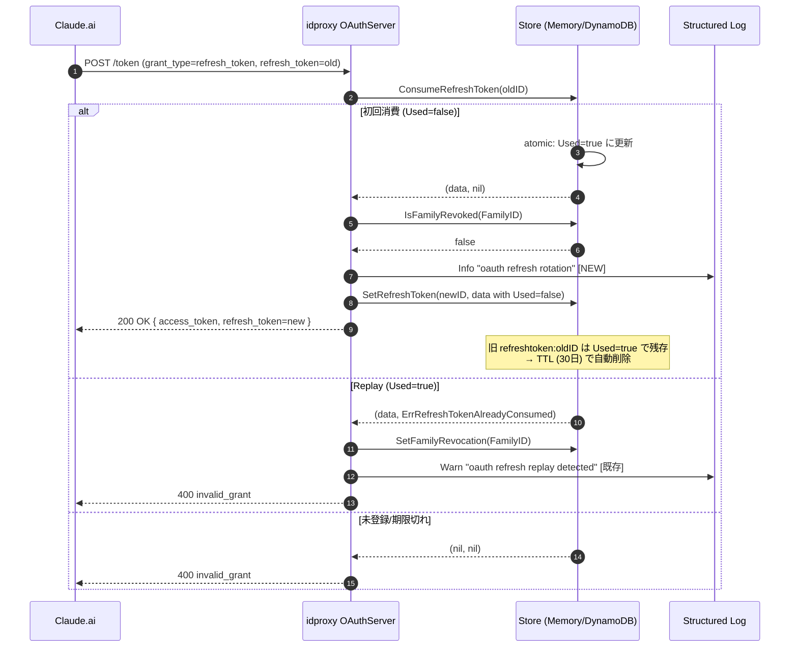

# idproxy v0.3.1 — refresh_token rotation 可観測性強化パッチ

## Context

### 経緯

v0.3.0 で OAuth 2.1 §4.3.2 準拠の refresh_token rotation を実装・リリース（2026-04-19）。
本番デプロイ後、logvalet-mcp 実装担当者から参考プラン経由で以下の報告を受領:

> 本番 DynamoDB で refresh 実行後も旧 `refreshtoken:<old>` が残存しており、
> OAuth 2.1 §4.3.2 "MUST invalidate" に違反している可能性がある

### 調査結果（2026-04-20, コードレビューベース）

参考プランの前提「rotation 未実装」は **idproxy v0.3.0 の設計との不一致に起因する誤認** と結論。
実装は意図的な `Used=true` フラグ方式を採用しており、OAuth 2.1 に準拠している:

| 観点 | 実装箇所 | 状態 |
|------|---------|------|
| Store IF 定義 | `store.go:35-43`（ConsumeRefreshToken / SetFamilyRevocation / IsFamilyRevoked） | ✅ 実装済み |
| Memory atomic consume | `store/memory.go:354-382`（W-Lock 配下で `Used=true` 更新） | ✅ 実装済み |
| DynamoDB atomic CAS | `store/dynamodb.go:501-572`（`attribute_exists(pk) AND used = :false` CAS） | ✅ 実装済み |
| Top-level `used` 属性 | `store/dynamodb.go:429-447`（`putRefreshTokenItem`） | ✅ 実装済み |
| oauth_server consume flow | `oauth_server.go:501-556`（consume → replay 検知 → family revoke → issue） | ✅ 実装済み |
| Race test | `store/memory_test.go:1006`, `store/dynamodb_test.go:1322`（20 goroutine） | ✅ 実装済み |
| Replay 検知ログ | `oauth_server.go:517`（`"oauth refresh replay detected"`） | ✅ 実装済み |

### 設計判断の根拠（CLAUDE.md 既存記述）

> **refresh_token rotation**: OAuth 2.1 §4.3.2 準拠。使用時に `Used=true` に atomic 更新
> （削除ではなく）することで replay 検知時も `FamilyID` を取得可能にする。

"MUST invalidate" は "MUST delete" ではない。`Used=true` マークにより:
- 旧トークンでの新規発行を ConsumeRefreshToken が拒否（仕様を満たす）
- レコード残存により replay 検知時に `FamilyID` を取り出せる（family 全 revoke のため）
- TTL (30日) で自動削除

### 実証確認の留保事項（実装前に必要）

本調査は **コードレビューのみ** に基づく。本番で観察された `refreshtoken:hRLl59pQ...` に
`used=true` 属性が実際にセットされているかは未確認。v0.3.1 タグ付け前に以下を実施すること:

```bash
aws dynamodb scan \
  --profile core --region ap-northeast-1 \
  --table-name logvalet-idproxy-store \
  --filter-expression 'begins_with(pk, :prefix)' \
  --expression-attribute-values '{":prefix":{"S":"refreshtoken:"}}' \
  --projection-expression 'pk, #u, #t' \
  --expression-attribute-names '{"#u":"used","#t":"ttl"}'
```

- **Used=true がセットされていた場合** → 本プランで進行（可観測性のみ追加）
- **Used 属性が欠落 / false のままだった場合** → 前提が崩れるため別プラン（参考プラン相当）を策定し直す

### 本パッチで対処する問題点

実装は正しいが、副次的に以下のギャップが残存している:

1. **可観測性欠如**: `ConsumeRefreshToken` 成功時のログが無く、外部観測者が DynamoDB scan のみで「rotation が発生したか」を判断できない（replay 検知時のみ Warn ログ）
2. **ドキュメント**: CLAUDE.md は言及しているが README.md / README_ja.md に rotation 設計の根拠が未記載。外部観測者が誤認する余地を残している

### 解決アプローチ

挙動変更を一切行わず、以下のみを実施（複雑度 L）:
- `oauth_server.go` に rotation 成功ログを 1 箇所追加
- 新規ログに対応するテストを 1 ケース追加
- README / CLAUDE.md / CHANGELOG に設計意図を明記

## スコープ

### 実装範囲（In）

| ファイル | 変更内容 |
|---------|---------|
| `oauth_server.go` | `tokenHandlerRefresh` の consume 成功 & family revoke 無し確認後に `info` ログ 1 行追加 |
| `oauth_server_test.go` | 追加ログが正しく出力されることを検証するテストを 1 ケース追加 |
| `README.md` | "Refresh Token Rotation Design" セクション追加 |
| `README_ja.md` | 「リフレッシュトークン Rotation の設計方針」セクション追加 |
| `CLAUDE.md` | 既存 "refresh_token rotation" 節に運用観点（DynamoDB 観察手順）を追記 |
| `CHANGELOG.md` | v0.3.1 エントリ追加 |

### スコープ外（Out）

- Store interface 定義の変更
- `ConsumeRefreshToken` / `GetRefreshToken` / `SetRefreshToken` 本体の変更
- Store 層のテスト（`store/memory_test.go`, `store/dynamodb_test.go`）への変更
- 既存 oauth_server テスト（T5/T8/T12 相当）の強化
- 本番 DynamoDB 既存レコードのマイグレーション（TTL で自然削除）
- logvalet / logvalet-mcp 側の変更（別リポジトリ）

## テスト設計書

新規追加分のみ（回帰テストは追加しない）:

### 正常系ケース

| ID | 対象 | 入力 | 期待出力 |
|----|------|------|---------|
| T5-L | `oauth_server_test.go` の既存 refresh_token 成功ケースに追加 | 有効な refresh_token で `POST /token grant_type=refresh_token` | captured logger に `oauth refresh rotation` イベント 1 件、フィールドに `family_id` / `client_id` / `scope` を含む |
| T5-L-sec | 同上 | 同上 | ログメッセージに refresh_token 文字列そのものが **含まれない** ことを assert |

### TDD 順序

1. **Red**: T5-L / T5-L-sec を `oauth_server_test.go` に追加 → ログ未実装のため FAIL
2. **Green**: `oauth_server.go` に `s.logger.Info("oauth refresh rotation", ...)` を追加 → PASS
3. **Refactor**: ログのフィールド順を既存 `oauth refresh replay detected` と揃える

### テストユーティリティ

既存の captured logger パターンを踏襲。無ければ `slog.NewJSONHandler(&buf, nil)` で `bytes.Buffer` 捕捉。

## 実装手順

### Step 0: 本番事前確認（実装開始前）

上記「実証確認の留保事項」のコマンドを実施し、`used=true` が実際にセットされていることを確認。
欠落・false が見つかった場合は本プランを中止して別プランを策定する。

### Step 1: oauth_server_test.go にログ捕捉テストを追加（Red）

- **ファイル**: `oauth_server_test.go`
- **概要**: 既存の refresh_token success テストを拡張し、`oauth refresh rotation` ログ出力を検証するアサートを追加
- **依存**: なし
- **Red 期待**: ログ未実装のため FAIL

### Step 2: oauth_server.go に rotation 成功ログ追加（Green）

- **ファイル**: `oauth_server.go`
- **変更箇所**: `tokenHandlerRefresh` 内、`ConsumeRefreshToken` 成功 & `IsFamilyRevoked==false` & `ClientID 一致` の全チェック後、`issueTokenResponse` 呼び出しの直前（現 line 555 付近）
- **追加コード**（イメージ）:
  ```go
  s.logger.Info("oauth refresh rotation",
      "family_id", data.FamilyID,
      "client_id", data.ClientID,
      "scope", strings.Join(data.Scopes, " "),
  )
  // 既存: s.issueTokenResponse(w, r, user, data.Scopes, data.ClientID, data.FamilyID)
  ```
- **セキュリティ要件**: refresh_token 文字列はログに含めない（既存 `oauth refresh replay detected` と同様のフィールド構成）
- **依存**: Step 1

### Step 3: ドキュメント更新

- **ファイル**:
  - `README.md`: "Refresh Token Rotation Design" セクション（英語）
  - `README_ja.md`: 「リフレッシュトークン Rotation の設計方針」セクション（日本語）
  - `CLAUDE.md`: 既存 refresh_token 節に本番運用ガイド（DynamoDB scan で `used` 属性を projection する手順）を追記
  - `CHANGELOG.md`: v0.3.1 エントリ追加
- **ドキュメント要点**:
  - "Used flag" 方式採用の理由（replay 検知時の `FamilyID` 取得性）
  - OAuth 2.1 §4.3.2 / RFC 9700 §2.2.2 との準拠関係
  - 本番 DynamoDB 観察時に `used` 属性を projection する手順
  - 新ログ `oauth refresh rotation` の意味
  - CHANGELOG の要約: `fix: add observability log and design clarification for refresh_token rotation (no behavior change)`
- **依存**: Step 2

### Step 4: 品質ゲート

```bash
cd /Users/youyo/src/github.com/youyo/idproxy
go test -race -cover ./...
go test -race -tags=integration ./...
golangci-lint run
```

全緑を確認。

### Step 5: リリース

- コミット（Conventional Commits 日本語）: `fix(oauth): refresh_token rotation の可観測性向上と設計明文化`
- `main` push → CI green → `v0.3.1` タグ push → GoReleaser 自動リリース
- logvalet-mcp 担当者に v0.3.1 リリース通知と参考プランの誤認解消を連絡（別途、本パッチのスコープ外）

## アーキテクチャ検討

### 既存パターンとの整合性

- **ログフォーマット**: 既存 `s.logger.Warn("oauth refresh replay detected", "family_id", ..., "client_id", ...)` (oauth_server.go:517) と対称的に `Info` レベルで `oauth refresh rotation` を追加
- **フィールド構成**: `family_id` / `client_id` / `scope` を既存ログと統一
- **イベントペア**: `oauth refresh rotation`（正常）↔ `oauth refresh replay detected`（replay）で rotation lifecycle を完全にカバー

### 新規モジュール設計

新規モジュールなし。

## リスク評価

| リスク | 重大度 | 影響 | 対策 |
|--------|--------|------|------|
| 前提（Used=true 実装正しい）がコードレビューのみに基づく | 高 | プランの前提崩壊 | Step 0 で本番 DynamoDB を実証確認。欠落・false ならプラン中止 |
| ログに refresh_token 全文が漏洩 | 高 | トークン盗用の危険 | family_id / client_id / scope のみログ。token 文字列は絶対に書かない（T5-L-sec でアサート） |
| 既存挙動の意図せぬ変更 | 低 | rotation が壊れる | 本パッチは挙動変更なし（ログ追加のみ）。既存 race test / replay test が CI で継続緑 |
| CHANGELOG / README の誤記で誤認再発 | 中 | 外部観測者の混乱継続 | logvalet-mcp 担当者（参考プラン作成者）に v0.3.1 後の README を共有 |
| ログ volume 増加でコスト上昇 | 低 | CloudWatch Logs 料金 | 1 refresh あたり 1 件、Lambda 想定では無視できる |

## フェイルセーフ / ロールバック

- 挙動変更が無いため障害発生の可能性は極めて低い
- 万一問題があれば `git revert <commit>` で v0.3.0 状態に戻し、v0.3.2 で再修正

## シーケンス図



## 検証コマンド

### ユニット / 統合テスト

```bash
cd /Users/youyo/src/github.com/youyo/idproxy
go test -race -cover ./...
go test -race -tags=integration ./...
golangci-lint run
```

### 本番での rotation 可視化確認（v0.3.1 デプロイ後、logvalet-mcp 側で実施可能）

```bash
# CloudWatch Logs で rotation イベントを検索
aws logs tail /aws/lambda/logvalet-mcp \
  --profile core --region ap-northeast-1 --follow \
  --filter-pattern '"oauth refresh rotation"'
```

期待動作: refresh 1 回ごとに `oauth refresh rotation` イベントが 1 件出力される。

## チェックリスト

### 観点1: 実装実現可能性と完全性
- [x] 手順の抜け漏れがない（Step 0 → 5）
- [x] 各ステップが具体的（ファイル path・行番号）
- [x] 依存関係が明示
- [x] 変更対象ファイルが網羅（6 ファイル、うちコード 2 / ドキュメント 4）
- [x] 影響範囲が明確（挙動変更なし）

### 観点2: TDD テスト設計
- [x] 正常系: T5-L（ログ出力）/ T5-L-sec（token 非漏洩）
- [x] 異常系: N/A（挙動変更なし、既存 replay テストで継続カバー）
- [x] エッジケース: token 全文非漏洩
- [x] 入出力が具体的
- [x] Red → Green → Refactor 順序
- [x] モック/スタブ: 既存 captured logger パターン

### 観点3: アーキテクチャ整合性
- [x] 既存 slog ログフォーマットに一致
- [x] `oauth refresh replay detected` と対称的なイベント命名
- [x] モジュール分割変更なし
- [x] 依存方向正しい
- [x] 類似機能（既存 Warn ログ）と統一

### 観点4: リスク評価と対策
- [x] リスク特定済み（5 項目、前提確認を最高重大度で明記）
- [x] 対策具体的
- [x] フェイルセーフ（挙動変更なし）
- [x] パフォーマンス影響無視できる
- [x] セキュリティ: token 全文非ログをテストで強制
- [x] ロールバック: `git revert` で即座

### 観点5: シーケンス図の完全性
- [x] 正常フロー・Replay・未登録の 3 経路
- [x] Client / idproxy / Store / Logs の相互作用
- [x] atomic CAS タイミング明記
- [x] TTL 挙動注記

## 関連ドキュメント

- 参考プラン: `/Users/youyo/src/github.com/heptagon-inc/logvalet-mcp/plans/sunny-noodling-sutton-idproxy-v0.3.1-fix.md`
- 既存実装: oauth_server.go / store/memory.go / store/dynamodb.go（v0.3.0）
- CLAUDE.md refresh_token セクション（設計意図の記載元）
- OAuth 2.1 Draft §4.3.2 / RFC 9700 §2.2.2

## Next Action

> このプランを実装するには以下を実行してください:
> `/devflow:implement` — このプランに基づいて実装を開始
> `/devflow:cycle` — 自律ループで複数マイルストーンを連続実行
