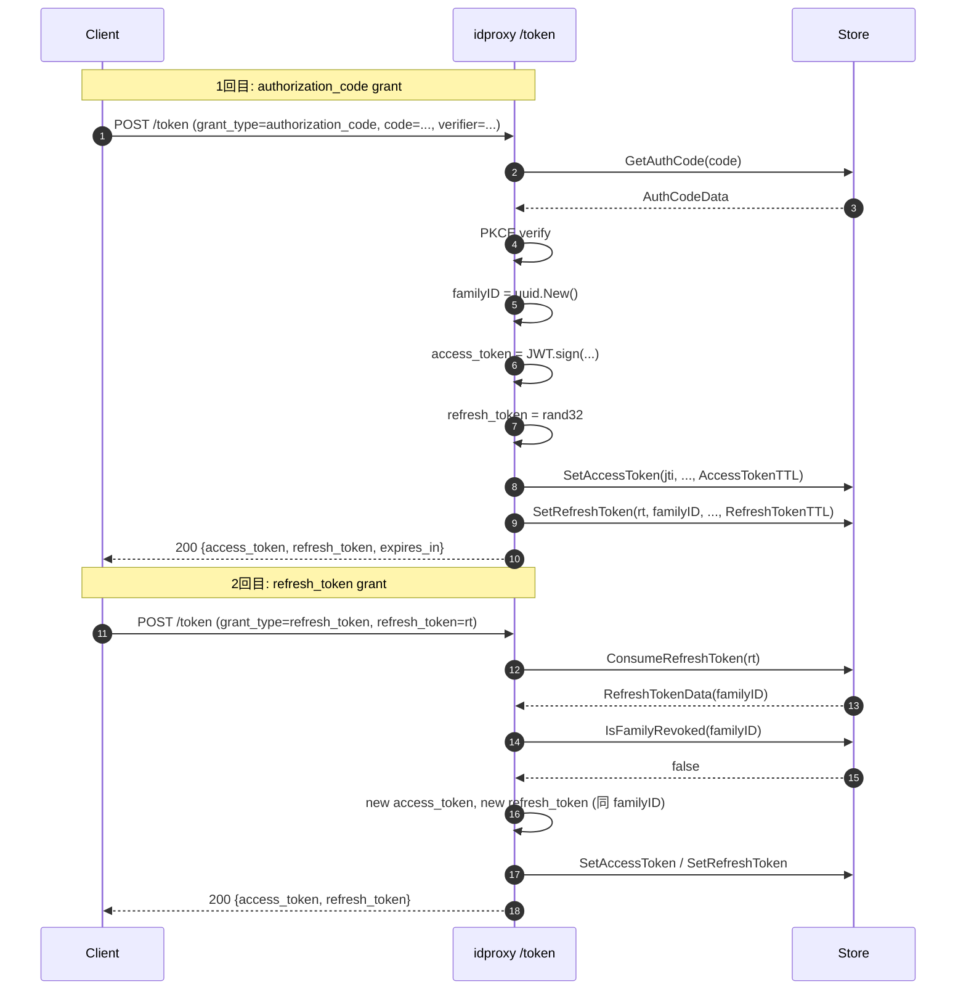
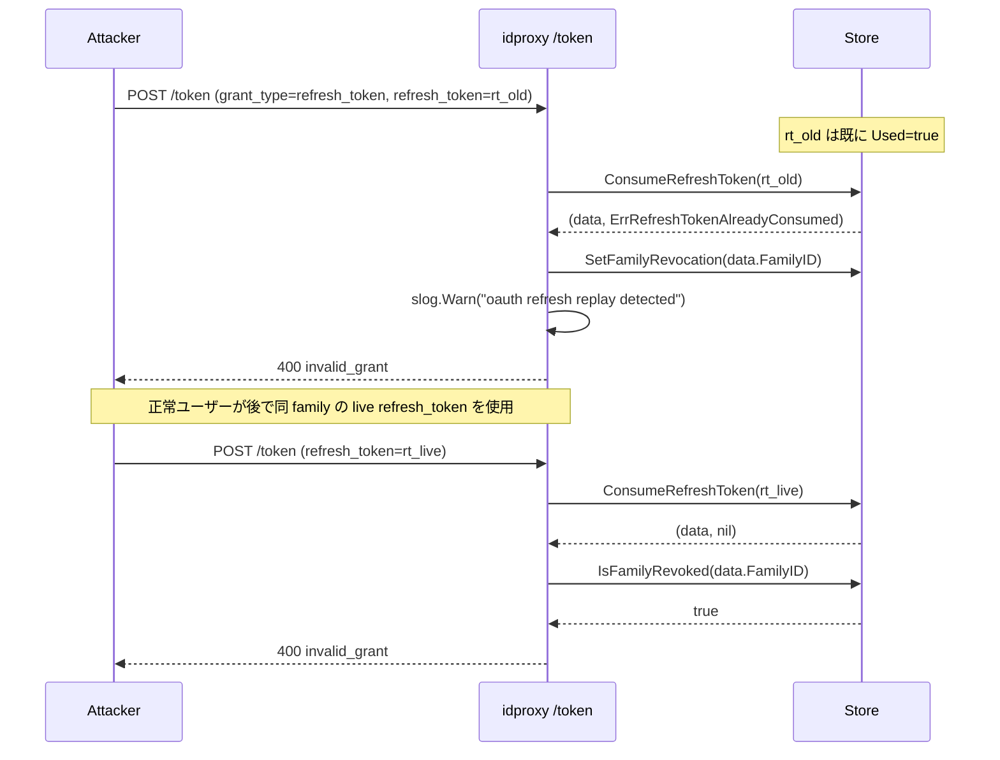

# idproxy v0.3.0 — OAuth refresh_token grant 実装（修正プラン）

## Context

logvalet-mcp の Claude.ai コネクタが 1h ごとに再認証を要求する問題の根本原因は、idproxy が OAuth 2.1 の `refresh_token` grant を未実装であること（上流プラン参照）。上流プランを idproxy リポジトリの実コードに合わせて補正し、併せて調査中に発見した以下のバグも同時修正する。

**発見バグ**: `oauth_server.go:472, 517` で access_token TTL が `time.Hour` でハードコードされており、`Config.AccessTokenTTL` が**完全に無視されている**。refresh_token を Config.RefreshTokenTTL で設定するのと整合を取るため、同時に修正する。

### 上流プランからの補正点

| 上流の記述 | 実際 |
|---|---|
| `store_memory.go` / `store_dynamodb.go` | `store/memory.go` / `store/dynamodb.go`（サブパッケージ配置） |
| `sync.Mutex` 前提 | 既存は `sync.RWMutex` + `memoryEntry[T]` ジェネリクス |
| `tokenHandler` 行 369-535 | 実際は 369-590（T2 で refresh_token 発行を追加すると更に伸びる） |
| DCR 行 624, 641 | 624 が `GrantTypes` 初期化、641 は応答 JSON のキー参照のみ（変更は 624 側） |
| Phase 0 を v0.2.3 で先行リリース | **ユーザー判断により v0.3.0 に統合**（単発リリース） |
| family revocation を scan で | **ユーザー判断により tombstone レコード方式**を採用 |

## ゴール

1. OAuth 2.1 準拠の `refresh_token` grant を実装（rotation + family tracking + replay detection）
2. `Config.RefreshTokenTTL` を追加（デフォルト 30 日）
3. **バグ修正**: access_token TTL を `Config.AccessTokenTTL` から参照するよう変更
4. `/authorize` と `/token` に構造化診断ログを追加
5. 単一リリース v0.3.0 でタグ打ち

## スコープ

### 含む
- `Store` インターフェース拡張（`SetRefreshToken` / `GetRefreshToken` / `ConsumeRefreshToken` / `SetFamilyRevocation` / `IsFamilyRevoked`）
- `RefreshTokenData` データ型追加
- `store/memory.go`, `store/dynamodb.go` 両方に実装
- `oauth_server.go` の discovery / DCR / tokenHandler 拡張
- `Config.RefreshTokenTTL` 追加
- `authorizeHandler` / `tokenHandler` に `slog.Info` 診断ログ
- `AccessTokenTTL` ハードコードバグの修正

### 含まない
- PAR, CIBA, DPoP
- `offline_access` scope 概念
- logvalet / logvalet-mcp 側の変更（上流プラン管轄）
- tokenHandler の大規模リファクタ（関数分割は v0.3.1 以降）

---

## 設計決定

### refresh_token 形式
- opaque ランダム **32 byte** を `base64.RawURLEncoding` でエンコード
- JWT ではない（自己完結する必要がない。Store で全て管理）
- 生成: `crypto/rand.Read(b)` → `base64.RawURLEncoding.EncodeToString(b)`

### family tracking（tombstone 方式）
- 各 `authorization_code` grant で `familyID = uuid.New().String()` を生成
- 同一チェーン内の全 refresh_token が同じ `FamilyID` を保持
- replay 検知時: `SetFamilyRevocation(familyID, ttl=RefreshTokenTTL)` で **tombstone レコード**を書き込む
- 以降の refresh 処理で `IsFamilyRevoked(familyID)` を最初に呼び、true なら即座に `invalid_grant`
- 現在の live な refresh_token の実物削除は不要（tombstone チェックで無効化されるため）

### rotation の原子性（Used フラグ UPDATE 方式）
replay 検知時に **familyID を取得する必要がある**ため、単純な delete ではなく `Used=true` に原子更新する方式を採用する。レコード自体は TTL 到達まで残し、`Used=true` なら消費済みと判定する。

- **MemoryStore**: `sync.RWMutex` を W-Lock して「Get → Used 確認 → Used=true に更新 → コピー返却」を一貫実行
  - 1 回目: `Used=false` → `Used=true` に更新、data を返却
  - 2 回目以降: `(data, ErrRefreshTokenAlreadyConsumed)` を返却（familyID を保持した data を同時に返す点がポイント）
- **DynamoDBStore**: `UpdateItem` + `ConditionExpression: "attribute_exists(pk) AND #used = :false"` + `ReturnValues: types.ReturnValueAllNew`
  - `#used` / `:false` は `ExpressionAttributeNames` / `ExpressionAttributeValues` で参照
  - 成功時: 返却された `data` から `RefreshTokenData` を復元して返却
  - `*types.ConditionalCheckFailedException`: 「存在しない」or「既に Used=true」の 2 パターンを区別するため、エラー検知時に追加で `GetItem` を実行
    - 取得成功 → `(data, ErrRefreshTokenAlreadyConsumed)`（familyID あり）
    - 取得失敗（not found） → `(nil, nil)`（ErrRefreshTokenAlreadyConsumed ではなく、未登録扱い = `invalid_grant`）
  - TTL 切れ対策: 返却データの `ExpiresAt` を現在時刻と比較して期限切れは `(nil, nil)` 扱い（既存 `getItemJSON` パターン踏襲）
- レコード肥大化: TTL 到達（30 日）で自動削除されるため運用上問題なし

### TTL
- `Config.RefreshTokenTTL`（`OAuthConfig` ではなく `Config` 直下、既存の `AccessTokenTTL`, `AuthCodeTTL` と揃える）
- デフォルト 30 日（`30 * 24 * time.Hour`）
- `DefaultConfig` への追加 + `Validate()` のデフォルト適用ブロックへの追加

### DynamoDB キー設計（既存の `:` セパレータに揃える）
- `refreshtoken:<opaque_id>` — refresh_token レコード
- `familyrevoked:<familyID>` — tombstone レコード
- `ttl` 属性は既存パターン（`putItemJSON` の第4引数）を再利用

### RefreshTokenData 構造体
```go
type RefreshTokenData struct {
    ID        string    // opaque refresh_token 文字列そのもの（キー）
    FamilyID  string    // UUID v4
    ClientID  string    // 発行時の client_id
    Subject   string    // ユーザー sub
    Email     string    // access_token 再発行用
    Name      string    // access_token 再発行用
    Scopes    []string
    IssuedAt  time.Time
    ExpiresAt time.Time
    Used      bool      // 消費済みフラグ。ConsumeRefreshToken で true に更新
}
```

### 診断ログ
- `oauth_server.go` `authorizeHandler` 冒頭:
  ```go
  s.logger.Info("oauth authorize", "client_id", clientID, "has_session", sess != nil)
  ```
- `tokenHandler` 冒頭（grant_type パース直後）:
  ```go
  s.logger.Info("oauth token", "grant_type", grantType, "client_id", clientID)
  ```
- replay 検知時:
  ```go
  s.logger.Warn("oauth refresh replay detected", "family_id", familyID, "client_id", clientID)
  ```

---

## TDD テスト設計

### 正常系

| ID | テスト | 期待動作 |
|----|------|---------|
| T1 | `grant_type=refresh_token` で有効な refresh_token を送る | 200, `access_token, token_type, expires_in, refresh_token` を返し、応答 refresh_token は入力と**異なる**値 |
| T2 | `grant_type=authorization_code` の成功フロー | 200, 応答に `refresh_token` フィールドが**追加**される（既存 access_token 部分は変化なし） |
| T3 | `GET /.well-known/oauth-authorization-server` | `grant_types_supported: ["authorization_code", "refresh_token"]`（順序含めて検証） |
| T4 | `POST /register` DCR 応答 | `grant_types: ["authorization_code", "refresh_token"]` |
| T5 | refresh 成功後の Store | 旧 `refreshtoken:<old>` が `Used=true` で残存（`Get` で取得可能）、新 `refreshtoken:<new>` は `Used=false` で存在、両者 `FamilyID` は同一 |
| T15 | 新機能: `Config.AccessTokenTTL=30m` を設定 | access_token の `exp` と Store 上の TTL が 30 分（現在ハードコードの time.Hour ではない） |

### 異常系

| ID | テスト | 期待動作 |
|----|------|---------|
| T6 | `refresh_token` パラメータ欠損 | 400 `invalid_request` |
| T7 | 未登録 refresh_token を指定 | 400 `invalid_grant` |
| T8 | 同一 refresh_token を 2 回使用（replay） | 1回目: 200 成功、2回目: 400 `invalid_grant` + 同 family の tombstone が Store に書き込まれる |
| T8b | T8 の後、同 family から派生した別の refresh_token を使用 | 400 `invalid_grant`（tombstone による無効化） |
| T9 | `RefreshTokenTTL=1ms` で待機後に使用 | 400 `invalid_grant`（期限切れ） |
| T10 | client_id 不一致で refresh | 400 `invalid_grant` |
| T11 | `grant_type=authorization_code` リクエストに `refresh_token` パラメータ混在 | T2 通り動作、refresh_token 入力は無視 |

### エッジ / 並行

| ID | テスト | 期待動作 |
|----|------|---------|
| T12 | 同一 refresh_token を 2 goroutine で同時送信 | 片方 200、片方 400 `invalid_grant`（`sync.RWMutex` / `ConditionExpression` で排他） |
| T13 | `RefreshTokenTTL=0` で初期化 | `Validate()` 後に `30 * 24 * time.Hour` が適用されている |
| T14 | MemoryStore と DynamoDBStore（fake client）で T1/T5/T8 同一挙動 | integration スタイルでストア抽象化を検証 |

### TDD 実装順序
1. **Red**: `oauth_server_test.go` に T1〜T14, T15 を追加（全 FAIL）
2. **Red**: `store/memory_test.go`, `store/dynamodb_test.go` に Store 新メソッドのテスト追加
3. **Green**: Store interface 拡張 → `mockStore` スタブ先行更新（コンパイル維持）→ 両 Store 実装追加 → tokenHandler 分岐追加 → Config 拡張 → access_token TTL バグ修正 → Discovery/DCR 更新 → 診断ログ
4. **Refactor**: `issueTokenResponse(w, user, scopes, clientID, familyID)` ヘルパ抽出で authcode / refresh 両経路の access_token + refresh_token 発行を共通化

---

## 実装手順

### Step 1 (Red): テスト追加とコンパイル維持
⚠️ **重要な実装順序**: `Store` interface に 5 メソッド追加すると全テストファイルがコンパイルエラーになる。以下の順で実施:

1. **最初**: `store_test.go` の `mockStore` に新メソッドのスタブを追加（コンパイル維持）
2. **次**: `store.go` の interface 拡張（Step 2 の先行部分）
3. **それから** 失敗テストを追加:
   - ファイル: `oauth_server_test.go` — T1〜T14, T15 追加（既存 `setupOAuthServer()` ヘルパ再利用）
   - ファイル: `store/memory_test.go`, `store/dynamodb_test.go` — 新メソッドの単体テスト追加
   - 既存の `fakeDynamoDBClient`（`store/dynamodb_test.go:20-159`）は `UpdateItem` メソッドが未実装のため拡張が必要（fake に `UpdateItem(ctx, input, ...) (*UpdateItemOutput, error)` を追加）

### Step 2 (Green): `Store` インターフェース拡張
- ファイル: `store.go`
  - `RefreshTokenData` 構造体追加（Subject/Email/Name/ClientID/Scopes/FamilyID/IssuedAt/ExpiresAt）
  - `Store` インターフェースに 5 メソッド追加:
    ```go
    SetRefreshToken(ctx context.Context, id string, data *RefreshTokenData, ttl time.Duration) error
    GetRefreshToken(ctx context.Context, id string) (*RefreshTokenData, error)
    ConsumeRefreshToken(ctx context.Context, id string) (*RefreshTokenData, error)
    SetFamilyRevocation(ctx context.Context, familyID string, ttl time.Duration) error
    IsFamilyRevoked(ctx context.Context, familyID string) (bool, error)
    ```
  - `ErrRefreshTokenAlreadyConsumed` エラー変数を追加

### Step 3 (Green): `MemoryStore` 実装
- ファイル: `store/memory.go`
  - `MemoryStore` 構造体に `refreshTokens map[string]*memoryEntry[idproxy.RefreshTokenData]`, `familyRevoked map[string]*memoryEntry[struct{}]` を追加
  - `ConsumeRefreshToken`: W-Lock 下で「存在確認 → Used フラグ確認 → Used=true に更新 → コピー返却」を一貫実行
    - 未登録 → `(nil, nil)`
    - 期限切れ → `(nil, nil)`（既存パターン踏襲）
    - `Used=true` で既に消費済み → `(data, ErrRefreshTokenAlreadyConsumed)`（familyID 含む data を返す）
    - `Used=false` → `Used=true` に更新してコピーを返却
  - `cleanupLoop` に refresh_token / family_revoked の期限切れ削除を追加

### Step 4 (Green): `DynamoDBStore` 実装
- ファイル: `store/dynamodb.go`
  - PK 生成関数追加: `refreshTokenPK(id)` / `familyRevokedPK(familyID)`
  - `SetRefreshToken`: 既存 `putItemJSON` を再利用（`data.Used = false` で保存）
  - `GetRefreshToken`: 既存 `getItemJSON`（consistentRead=true, hasTTL=true）
  - `ConsumeRefreshToken`:
    - `UpdateItem` + `ConditionExpression: "attribute_exists(pk) AND #data_used = :false"` + `ReturnValues: types.ReturnValueAllNew`
    - JSON 内の `Used` フィールドを `data` 属性全体の更新で書き換える想定（最もシンプルな実装は `GetItem → 更新した JSON で PutItem + ConditionExpression` の 2 操作コンボ）
    - **代案（推奨）**: `putItemJSON` の条件付き版 `putItemJSONConditional` を新設し、`ConditionExpression: "attribute_not_exists(pk) OR #data.used = :false"` のような形で atomic 更新
    - 最も堅実な実装: **`GetItem (ConsistentRead)` → `Used` チェック → `PutItem + ConditionExpression: "attribute_exists(pk)"` で CAS ライクに更新**。`ConditionalCheckFailedException` 時はリトライではなくエラー扱い（レース時の 2 req 目が負ける = 正しい挙動）
    - `*types.ConditionalCheckFailedException` で「既に Used=true」が判明 → 追加 `GetItem` で data を取得 → `(data, ErrRefreshTokenAlreadyConsumed)`
    - 未登録時は初回の `GetItem` が nil → `(nil, nil)`
    - TTL 切れ: `getItemJSON` パターン踏襲で期限切れは `(nil, nil)` 扱い
  - `SetFamilyRevocation`: `putItemJSON` で tombstone を保存（`data` は空でよい、存在することが revoked の意味）
  - `IsFamilyRevoked`: `getItemJSON`（consistentRead=true）で存在チェック

### Step 5 (Green): `tokenHandler` 分岐追加
- ファイル: `oauth_server.go`
  - 行 389: `grant_type != "authorization_code"` → `switch grantType`（`authorization_code` / `refresh_token` / default: `unsupported_grant_type`）
  - 行 470-520 周辺: 既存の access_token 発行処理を `issueTokenResponse(...)` に抽出
    - 内部で refresh_token も生成して Store に保存
    - 応答 JSON に `refresh_token` フィールドを追加
    - `familyID` は authcode 経路では新規生成、refresh 経路では既存を引き継ぎ
  - refresh_token ブランチ（順序固定）:
    1. `ConsumeRefreshToken(refreshTokenID)` を呼ぶ（familyID を取得するため最初）
       - `(nil, nil)` → `invalid_grant`（未登録 or 期限切れ）
       - `(data, ErrRefreshTokenAlreadyConsumed)` → `SetFamilyRevocation(data.FamilyID)` を実行、`slog.Warn("oauth refresh replay detected", "family_id", data.FamilyID)` → `invalid_grant`
       - `(data, nil)` → 続行
    2. `IsFamilyRevoked(data.FamilyID)` チェック → true なら `invalid_grant`
    3. `client_id` 一致チェック（`data.ClientID == form.client_id`）→ 不一致なら `invalid_grant`
    4. `issueTokenResponse(w, data.User, data.Scopes, data.ClientID, data.FamilyID)` で新 access_token + 新 refresh_token を発行（familyID は維持）

### Step 6 (Green): Discovery / DCR 更新
- `oauth_server.go:110`: `grant_types_supported` に `"refresh_token"` 追加
- `oauth_server.go:624`: DCR の `GrantTypes` に `"refresh_token"` 追加

### Step 7 (Green): `Config` 拡張 + TTL バグ修正
- ファイル: `config.go`
  - 行 54 の下に:
    ```go
    // RefreshTokenTTL は OAuth 2.1 Refresh Token の有効期間。
    // デフォルト: 30日。
    RefreshTokenTTL time.Duration
    ```
  - 行 113 の `DefaultConfig` に `RefreshTokenTTL: 30 * 24 * time.Hour` を追加
  - 行 131 以下の `Validate()` デフォルト適用ブロックに RefreshTokenTTL を追加
- ファイル: `oauth_server.go`
  - 行 472: `expiresAt := now.Add(time.Hour)` → `now.Add(s.accessTokenTTL)`
  - 行 517: `time.Hour` → `s.accessTokenTTL`
  - `OAuthServer` 構造体に `accessTokenTTL`, `refreshTokenTTL` フィールドを追加し `NewOAuthServer` で `cfg.AccessTokenTTL`, `cfg.RefreshTokenTTL` から設定

### Step 8 (Green): 診断ログ追加
- `authorizeHandler` 冒頭に `s.logger.Info("oauth authorize", ...)`
- `tokenHandler` 冒頭（grant_type パース直後）に `s.logger.Info("oauth token", ...)`
- replay 検知パスに `s.logger.Warn("oauth refresh replay detected", ...)`

### Step 9 (Refactor): tokenHandler 内部整理
- 関数分割（`tokenHandlerAuthCode` / `tokenHandlerRefresh`）は**スコープ外**（v0.3.1 以降）
- 本 PR では `issueTokenResponse` ヘルパ抽出のみ行い、重複ロジックを減らす

### Step 10: ドキュメント + リリース
- `CHANGELOG.md`: v0.3.0 エントリ追加
  - Added: refresh_token grant、`Config.RefreshTokenTTL`、診断ログ
  - Fixed: `Config.AccessTokenTTL` が無視されていたバグ
- `README.md` / `README_ja.md`:
  - `Config.RefreshTokenTTL` を Environment Variables / Library Usage セクションに追記
  - `grant_types_supported` の説明を更新
- `CLAUDE.md`: `OAuthServer` 責務に refresh_token rotation を追記（該当セクションのみ）
- タグ: `git tag v0.3.0 && git push origin v0.3.0`（既存 GoReleaser ワークフローが起動）

---

## シーケンス図

### 正常系（authorization_code → refresh）



### Replay 検知



---

## リスク評価

| # | リスク | 重大度 | 対策 |
|---|------|:---:|------|
| 1 | rotation バグで一時的な認証失敗多発 | 高 | TDD（T1, T5, T8, T12）で事前検証。Step 9 の診断ログ `slog.Warn("oauth refresh replay detected")` の頻度を運用監視 |
| 2 | `Used=true` 更新方式で Store 肥大化 | 低 | TTL 到達で自動削除。30 日後にクリーンアップされる |
| 3 | 既存 `authorization_code` grant への影響 | 中 | T2, T11 で既存応答+新 `refresh_token` 追加の互換性担保。access_token フィールドは変更しない |
| 4 | Family revocation の誤爆（正常ユーザーをロック） | 中 | tombstone TTL は `RefreshTokenTTL` と同一 → 最大 30 日でリセット。grace window は v0.3.1 以降で検討 |
| 5 | AccessTokenTTL バグ修正の破壊的変更リスク | 低 | 既存コードは Config.AccessTokenTTL を設定してもハードコード 1h で上書きされていたため、修正後に実際の設定値が効くのみ（挙動として「設定通り動く」という回復的変更） |
| 6 | memory / dynamodb 実装差 | 中 | T14 で integration スタイル抽象化テスト必須 |
| 7 | T12 race condition | 中 | memory: `sync.RWMutex` を W-Lock。dynamodb: `ConditionExpression` による atomic 更新。`go test -race` で検証 |
| 8 | DynamoDB スキーマ | 低 | 新 PK プレフィクスの追加のみ、マイグレーション不要 |

---

## ファイル変更リスト

| ファイル | 変更種別 | 概要 |
|---------|--------|------|
| `store.go` | 修正 | `Store` interface に 5 メソッド追加、`RefreshTokenData`, `ErrRefreshTokenAlreadyConsumed` 追加 |
| `store_test.go` | 修正 | `mockStore` に新メソッドのスタブ |
| `store/memory.go` | 修正 | refresh_token + family_revoked の map 追加、5 メソッド実装、cleanupLoop 拡張 |
| `store/memory_test.go` | 修正 | 新メソッドのテスト追加 |
| `store/dynamodb.go` | 修正 | PK 関数追加、5 メソッド実装、`ConditionExpression` + `ReturnValues` の atomic 処理 |
| `store/dynamodb_test.go` | 修正 | fakeDynamoDBClient を `UpdateItem` 対応に拡張、新メソッドのテスト追加 |
| `config.go` | 修正 | `RefreshTokenTTL` フィールド追加、DefaultConfig・Validate() 更新 |
| `config_test.go` | 修正 | T13（RefreshTokenTTL デフォルト適用）テスト追加 |
| `oauth_server.go` | 修正 | discovery / DCR / tokenHandler / 診断ログ / AccessTokenTTL バグ修正 |
| `oauth_server_test.go` | 修正 | T1〜T12, T15 追加、setupOAuthServer 拡張 |
| `integration_test.go` | 修正 | T14 の integration 追加（memory/dynamodb 両対応） |
| `CHANGELOG.md` | 追記 | v0.3.0 エントリ |
| `README.md` / `README_ja.md` | 追記 | `RefreshTokenTTL` + `grant_types_supported` |
| `CLAUDE.md` | 追記 | OAuthServer 責務に refresh_token を追記 |

---

## 検証

```bash
# 単体テスト
cd /Users/youyo/src/github.com/youyo/idproxy
go test -race -cover ./...

# refresh_token 関連のみ
go test -race ./... -run 'TestRefresh|TestConsumeRefreshToken|TestFamilyRevoke|TestTokenHandler'

# 統合テスト
go test -race -tags=integration ./...

# lint
golangci-lint run
```

**合格判定基準**:
- T1〜T15 すべて PASS
- `go test -race` で race 未検出
- `golangci-lint run` でエラーなし（errcheck 含む）

エンドツーエンド検証は上流プラン `sunny-noodling-sutton.md` の Phase 3 を参照。

---

## ロールバック

- v0.3.0 → v0.2.2 に `go.mod` を戻せば完了（idproxy 自体はデプロイ物を持たない）
- 新規追加レコード（`refreshtoken:*`, `familyrevoked:*`）は TTL で自動削除されるため DynamoDB 側のクリーンアップ不要

---

## チェックリスト（5観点27項目）

### 観点1: 実装実現可能性と完全性
- [x] 手順の抜け漏れなし（Step 1〜11 で Red→Green→Refactor→Release を網羅）
- [x] 各ステップが具体的（行番号・関数名・シグネチャまで明記）
- [x] 依存関係が明示（Store 拡張 → tokenHandler 分岐 → Config）
- [x] 変更対象ファイル網羅（14 ファイル一覧）
- [x] 影響範囲特定（access_token 応答に refresh_token 追加のみ、既存フィールド変更なし）

### 観点2: TDD テスト設計の品質
- [x] 正常系 6 ケース（T1〜T5, T15）
- [x] 異常系 7 ケース（T6〜T11, T8b）
- [x] エッジケース 3 ケース（T12, T13, T14）
- [x] 入出力が具体的（`grant_type=xxx&refresh_token=yyy` レベル）
- [x] Red→Green→Refactor の順序（Step 1 で Red、Step 2-9 で Green、Step 10 で Refactor）
- [x] モック設計適切（既存 `fakeDynamoDBClient` 再利用、`UpdateItem` 対応は追加）

### 観点3: アーキテクチャ整合性
- [x] 命名規則（既存の `AccessTokenData`, `SetAccessToken` と対称な `RefreshTokenData`, `SetRefreshToken`）
- [x] 設計パターン（Store インターフェースパターン踏襲、TTL ラグ対策踏襲）
- [x] モジュール分割（store 実装は `store/` サブパッケージ、ルートは interface のみ）
- [x] 依存方向（`idproxy` → `store`、循環なし）
- [x] 類似機能との統一（`accesstoken:` PK パターン → `refreshtoken:`）

### 観点4: リスク評価と対策
- [x] リスク特定（8 件、技術/スケジュール/セキュリティ）
- [x] 対策具体化（テストID・ログ文言・設計代案）
- [x] フェイルセーフ（replay 検知→tombstone で自動拡散防止）
- [x] パフォーマンス（refresh あたり GetItem 2-3回、许容範囲）
- [x] セキュリティ（replay detection、family revocation、opaque token 使用）
- [x] ロールバック（単純な go.mod 戻し、Store スキーマは TTL で自然消滅）

### 観点5: シーケンス図の完全性
- [x] 正常フロー（authcode → refresh の 2 回 grant）
- [x] エラーフロー（replay 検知）
- [x] 参加者間の相互作用（Client / AS / Store）
- [x] タイミング（Used フラグ更新の atomic 性を注記）
- [x] リトライ / タイムアウト（TTL 切れは T9、race は T12）

---

## Next Action

> このプランを実装するには以下を実行してください:
> `/devflow:implement` — このプランに基づいて実装を開始
> `/devflow:cycle` — 自律ループで複数マイルストーンを連続実行
